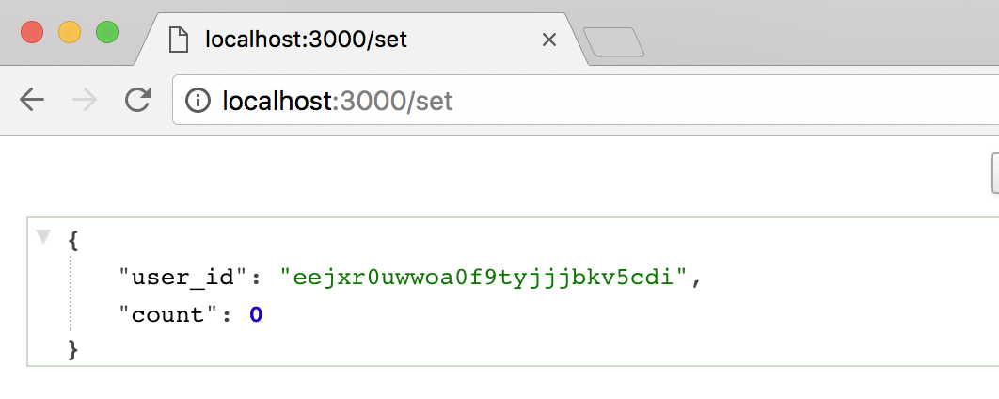
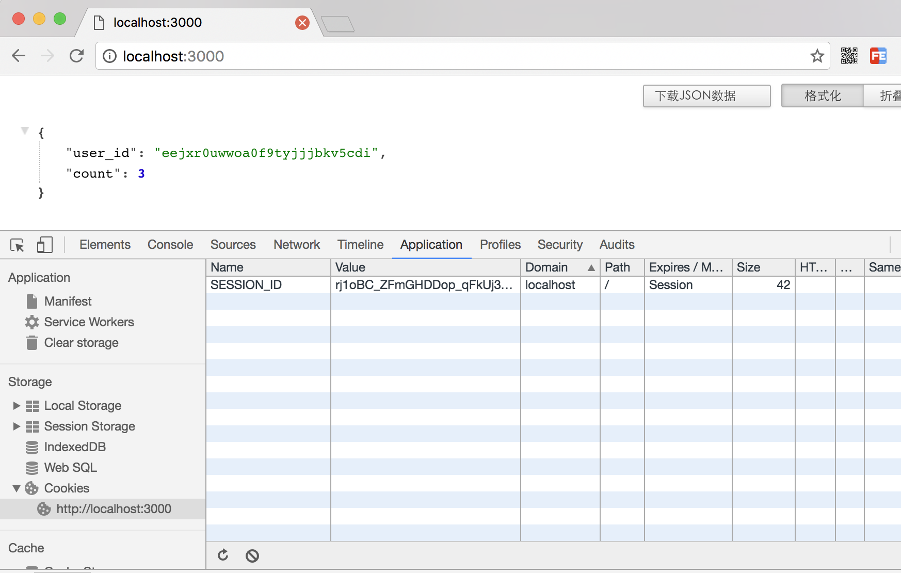

# koa2实现session

## 前言
koa2原生功能只提供了cookie的操作，但是没有提供session操作。session就只用自己实现或者通过第三方中间件实现。在koa2中实现session的方案有一下几种
- 如果session数据量很小，可以直接存在内存中
- 如果session数据量很大，则需要存储介质存放session数据

## 数据库存储方案
- 将session存放在MySQL数据库中
- 需要用到中间件
    - koa-session-minimal 适用于koa2 的session中间件，提供存储介质的读写接口 。
    - koa-mysql-session 为koa-session-minimal中间件提供MySQL数据库的session数据读写操作。
    - 将sessionId和对应的数据存到数据库
- 将数据库的存储的sessionId存到页面的cookie中
- 根据cookie的sessionId去获取对于的session信息

## 快速使用

demo源码 

[https://github.com/ChenShenhai/koa2-note/blob/master/demo/session/index.js](https://github.com/ChenShenhai/koa2-note/blob/master/demo/session/index.js)

### 例子代码
```js
const Koa = require('koa')
const session = require('koa-session-minimal')
const MysqlSession = require('koa-mysql-session')

const app = new Koa()

// 配置存储session信息的mysql
let store = new MysqlSession({
  user: 'root',
  password: 'abc123',
  database: 'koa_demo',
  host: '127.0.0.1',
})

// 存放sessionId的cookie配置
let cookie = {
  maxAge: '', // cookie有效时长
  expires: '',  // cookie失效时间
  path: '', // 写cookie所在的路径
  domain: '', // 写cookie所在的域名
  httpOnly: '', // 是否只用于http请求中获取
  overwrite: '',  // 是否允许重写
  secure: '',
  sameSite: '',
  signed: '',
  
}

// 使用session中间件
app.use(session({
  key: 'SESSION_ID',
  store: store,
  cookie: cookie
}))

app.use( async ( ctx ) => {

  // 设置session
  if ( ctx.url === '/set' ) {
    ctx.session = {
      user_id: Math.random().toString(36).substr(2),
      count: 0
    }
    ctx.body = ctx.session
  } else if ( ctx.url === '/' ) {

    // 读取session信息
    ctx.session.count = ctx.session.count + 1
    ctx.body = ctx.session
  } 
  
})

app.listen(3000)
console.log('[demo] session is starting at port 3000')
```

### 运行例子
#### 执行命令
```sh
node index.js
```

#### 访问连接设置session
[http://localhost:3000/set](http://localhost:3000/set)


#### 查看数据库session是否存储


#### 查看cookie中是否种下了sessionId
[http://localhost:3000](http://localhost:3000)



