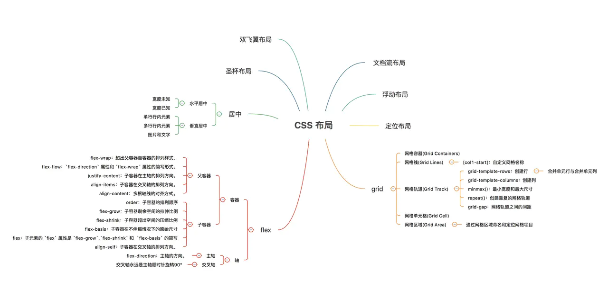

# 为网页添加样式

## 1. 术语解释

```css
h1{
    color:red;
    background-color:lightblue;
    text-align: center;
}
```

CSS规则 = 选择器 + 声明块

### + 选择器

|     选择器     |     格式      | 优先级权重 |
| :------------: | :-----------: | :--------: |
|    Id选择器    |      #id      |    100     |
|    类选择器    |  #classname   |     10     |
|   属性选择器   | a[ref="eee"]  |     10     |
|   伪类选择器   | li:last-child |     10     |
|   标签选择器   |      div      |     1      |
|  伪元素选择器  |   li:after    |     1      |
| 相邻兄弟选择器 |     h1+p      |     0      |
|    子选择器    |     ul>li     |     0      |
|   后代选择器   |     li a      |     0      |
|  通配符选择器  |       *       |     0      |

**注意事项：**

- !important声明的样式的优先级最高；
- 如果优先级相同，则最后出现的样式生效；
- 继承得到的样式的优先级最低；
- 通用选择器（*）、子选择器（>）和相邻同胞选择器（+）并不在这四个等级中，所以它们的权值都为 0 ；
- 样式表的来源不同时，优先级顺序为：内联样式 > 内部样式 > 外部样式 > 浏览器用户自定义样式 > 浏览器默认样式。

### + 声明块

出现在大括号中

声明块中包含很多声明（属性），每一个声明（属性）表达了某一方面的样式。


## 2. CSS代码书写位置

1. 内部样式表

书写在style元素中

2. 内联样式表，元素样式表

直接书写在元素的style属性中

3. 外部样式表[推荐]

将样式书写到独立的css文件中。

1). 外部样式可以解决多页面样式重复的问题
2). 有利于浏览器缓存，从而提高页面响应速度
3). 有利于代码分离（HTML和CSS），更容易阅读和维护

# 常见样式声明

1. color

元素内部的文字颜色

**预设值**：定义好的单词

**三原色，色值**：光学三原色（红、绿、蓝），每个颜色可以使用0-255之间的数字来表达，色值。

```
rgb表示法：
rgb(0, 255, 0)
hex（16进制）表示法：
#红绿蓝
```

淘宝红：#ff4400, #f40
黑色：#000000，#000
白色：#ffffff, #fff
红：#ff0000, #f00
绿：#00ff00, #0f0
蓝：#0000ff, #00f
紫：#f0f
青：#0ff
黄：#ff0
灰色：#ccc

2. background-color

元素背景颜色

3. font-size

元素内部文字的尺寸大小

1）px：像素，绝对单位，简单的理解为文字的高度占多少个像素
2）em：相对单位，相对于父元素的字体大小
每个元素必须有字体大小，如果没有声明，则直接使用父元素的字体大小，如果没有父元素（html），则使用基准字号。

3）rem  rem是以html根元素中font-size 的大小为基准的相对度量单位，文本的大小不会随着窗口的大小改变而改变

> user agent，UA，用户代理（浏览器）

4. font-weight

文字粗细程度，可以取值数字，可以取值为预设值

> strong，默认加粗。

5. font-family

文字类型

必须用户计算机中存在的字体才会有效。

使用多个字体，以匹配不同环境

sans-serif，非衬线字体

6. font-style

字体样式，通常用它设置斜体

> i元素，em元素，默认样式，是倾斜字体; 实际使用中，通常用它表示一个图标（icon）

7. text-decoration

文本修饰，给文本加线。

> a元素
> del元素：错误的内容
> s元素：过期的内容

8. text-indent

首行文本缩进

9.  line-height

每行文本的高度，该值越大，每行文本的距离越大。

设置行高为容器的高度，可以让单行文本垂直居中

行高可以设置为纯数字，表示相对于当前元素的字体大小

10.  width

宽度

11.  height

高度

12.  letter-space

文字间隙

13. text-align

元素内部文字的水平排列方式

# 选择器

选择器：帮助你精准的选中想要的元素

## 1. 简单选择器

1. ID选择器
2. 元素选择器
3. 类选择器
4. 通配符选择器

*，选中所有元素

5. 属性选择器

根据属性名和属性值选中元素

6. 伪类选择器

选中某些元素的某种状态

1）link: 超链接未访问时的状态

2）visited: 超链接访问过后的状态

3）hover: 鼠标悬停状态

4）active：激活状态，鼠标按下状态

爱恨法则：love hate

7. 伪元素选择器

before

after

## 2. 选择器的组合

1. 并且
2. 后代元素 —— 空格
3. 子元素 —— >
4. 相邻兄弟元素 —— +
5. 后面出现的所有兄弟元素 —— ~

## 3. 选择器的并列

多个选择器, 用逗号分隔

语法糖

# 层叠

声明冲突：同一个样式，多次应用到同一个元素

层叠：解决声明冲突的过程，浏览器自动处理（权重计算）

## 1. 比较重要性

重要性从高到底：

> 作者样式表：开发者书写的样式

1） 作者样式表中的!important样式
2)  作者样式表中的普通样式
3)  浏览器默认样式表中的样式

## 2. 比较特殊性

看选择器

总体规则：选择器选中的范围越窄，越特殊

具体规则：通过选择器，计算出一个4位数（x x x x）

1. 千位：如果是内联样式，记1，否则记0
2. 百位：等于选择器中所有id选择器的数量
3. 十位：等于选择器中所有类选择器、属性选择器、伪类选择器的数量
4. 个位：等于选择器中所有元素选择器、伪元素选择器的数量

## 3. 比较源次序

代码书写靠后的胜出


## 4.应用

1. 重置样式表

书写一些作者样式，覆盖浏览器的默认样式

重置样式表 -> 浏览器的默认样式

常见的重置样式表：normalize.css、reset.css、meyer.css

2. 爱恨法则

link > visited > hover > active

# 继承

子元素会继承父元素的某些CSS属性

通常，跟文字内容相关的属性都能被继承

## 无继承性的属性

1. **display**：规定元素应该生成的框的类型
2. **文本属性**：

- vertical-align：垂直文本对齐
- text-decoration：规定添加到文本的装饰
- text-shadow：文本阴影效果
- white-space：空白符的处理
- unicode-bidi：设置文本的方向

1. **盒子模型的属性**：width、height、margin、border、padding
2. **背景属性**：background、background-color、background-image、background-repeat、background-position、background-attachment
3. **定位属性**：float、clear、position、top、right、bottom、left、min-width、min-height、max-width、max-height、overflow、clip、z-index
4. **生成内容属性**：content、counter-reset、counter-increment
5. **轮廓样式属性**：outline-style、outline-width、outline-color、outline
6. **页面样式属性**：size、page-break-before、page-break-after
7. **声音样式属性**：pause-before、pause-after、pause、cue-before、cue-after、cue、play-during

## 有继承性的属性

1. **字体系列属性**

- font-family：字体系列
- font-weight：字体的粗细
- font-size：字体的大小
- font-style：字体的风格

1. **文本系列属性**

- text-indent：文本缩进
- text-align：文本水平对齐
- line-height：行高
- word-spacing：单词之间的间距
- letter-spacing：中文或者字母之间的间距
- text-transform：控制文本大小写（就是uppercase、lowercase、capitalize这三个）
- color：文本颜色

1. **元素可见性**

- visibility：控制元素显示隐藏

1. **列表布局属性**

- list-style：列表风格，包括list-style-type、list-style-image等

1. **光标属性**

- cursor：光标显示为何种形态

# 属性值的计算过程

一个元素一个元素依次渲染，顺序按照页面文档的树形目录结构进行


渲染每个元素的前提条件：该元素的所有CSS属性必须有值

一个元素，从所有属性都没有值，到所有的属性都有值，这个计算过程，叫做属性值计算过程

特殊的两个CSS取值：

- inherit：手动（强制）继承，将父元素的值取出应用到该元素
- initial：初始值，将该属性设置为默认值

# 盒模型

## 分类：

> 完整的 CSS 盒模型应用于块级盒子，内联盒子只使用盒模型中定义的部分内容

box：盒子，每个元素在页面中都会生成一个矩形区域（盒子）

盒子类型：

1. 行盒，display等于inline的元素
2. 块盒，display等于block的元素

行盒在页面中不换行、块盒独占一行

display默认值为inline

浏览器默认样式表设置的块盒：容器元素、h1~h6、p

常见的行盒：span、a、img、video、audio

## 1. 盒子的组成部分

无论是行盒、还是块盒，都由下面几个部分组成，从内到外分别是：

### + 内容  content

width、height，设置的是盒子内容的宽高

内容部分通常叫做整个盒子的**内容盒 content-box**

### + 填充(内边距)  padding

盒子边框到盒子内容的距离

padding-left、padding-right、padding-top、padding-bottom

padding: 简写属性

padding: 上 右 下 左

填充区+内容区 = **填充盒 padding-box**

+ 详解：

  padding-top  padding-bottom 无法撑开行内非替换元素容器的大小，但是如果给行内非替换元素设置背景，可以看到区域有增加的视觉效果的，但是增加的部分不会影响到其他元素，给人一种没有被撑开的错觉

### + 边框  border

边框 = 边框样式 + 边框宽度 + 边框颜色

边框样式：border-style
边框宽度：border-width
边框颜色：border-color

边框+填充区+内容区 = **边框盒 border-box**

### + 外边距  margin

边框到其他盒子的距离

margin-top、margin-left、margin-right、margin-bottom

速写属性margin

+ 详解：

  margin-top  margin-bottom 无法作用于行内元素中的非替换元素，行内非替换元素无法设置宽高，设置margin也无法撑开高度，所以margin-top和margin-bottom 用在行内非替换元素中时会失效

  ```css
  img{
      height: 100px;
      margin-top: 40px;
      margin-bottom: 40px;   // 会起作用
  }
  span {
      height: 100px; // 不会起作用
      margin-top: 40px; // 不会起作用
      margin-top: 40px; // 不会起作用
  }
  ```

  


# 盒模型应用

## 1. 改变宽高范围

默认情况下，width 和 height 设置的是内容盒宽高。

> 页面重构师：将psd文件（设计稿）制作为静态页面

衡量设计稿尺寸的时候，往往使用的是边框盒，但设置width和height，则设置的是内容盒

1. 精确计算
2. CSS3：box-sizing

## 2. 改变背景覆盖范围

默认情况下，背景覆盖边框盒

可以通过background-clip进行修改

## 3. 溢出处理

overflow，控制内容溢出边框盒后的处理方式

## 4. 断词规则

word-break，会影响文字在什么位置被截断换行

normal：普通。CJK字符（文字位置截断），非CJK字符（单词位置截断）

break-all：截断所有。所有字符都在文字处截断

keep-all：保持所有。所有文字都在单词之间截断

## 5. 空白处理

white-space: nowrap


# 块级盒子（块级元素）


# 内联盒子（行内元素）

常见的行盒：包含具体内容的元素

span、strong、em、i、img、video、audio

## 1. 显著特点

1. 盒子沿着内容沿伸
2. 行盒不能设置宽高

调整行盒的宽高，应该使用字体大小、行高、字体类型，间接调整。

3. 内边距（填充区）

水平方向有效，垂直方向不会实际占据空间。

4. 边框

水平方向有效，垂直方向不会实际占据空间。

5. 外边距

水平方向有效，垂直方向不会实际占据空间。


## 2. 行块盒

display：inline-block 的盒子

1. 不独占一行
2. 盒模型中所有尺寸都有效

## 3. 空白折叠

空白折叠，发生在行盒（行块盒）内部 或 行盒（行块盒）之间

## 4. 可替换元素 和 非可替换元素

大部分元素，页面上显示的结果，取决于元素内容，称为**非可替换元素**

少部分元素，页面上显示的结果，取决于元素属性，称为**可替换元素**

可替换元素：img、video、audio

绝大部分可替换元素均为行盒。

可替换元素类似于行块盒，盒模型中所有尺寸都有效。

# 常规流

盒模型：规定单个盒子的规则

视觉格式化模型（布局规则）：页面中的多个盒子排列规则

视觉格式化模型，大体上将页面中盒子的排列分为三种方式：

1. 常规流
2. 浮动
3. 定位

## 1. 常规流布局

常规流、文档流、普通文档流、常规文档流

所有元素，默认情况下，都属于常规流布局

总体规则：块盒独占一行，行盒水平依次排列

包含块（containing block）：每个盒子都有它的包含块，包含块决定了盒子的排列区域。

绝大部分情况下：盒子的包含块，为其父元素的内容盒

**块盒**

1. 每个块盒的总宽度，必须刚好等于包含块的宽度

宽度的默认值是auto

margin的取值也可以是auto，默认值0

auto：将剩余空间吸收掉

width吸收能力强于margin

若宽度、边框、内边距、外边距计算后，仍然有剩余空间，该剩余空间被margin-right全部吸收

在常规流中，块盒在其包含快中居中，可以定宽、然后左右margin设置为auto。

2. 每个块盒垂直方向上的auto值

height:auto， 适应内容的高度

margin:auto， 表示0

3. 百分比取值

padding、宽、margin可以取值为百分比

以上的所有百分比相对于包含块的宽度。

高度的百分比：

1）. 包含块的高度是否取决于子元素的高度，设置百分比无效
2）. 包含块的高度不取决于子元素的高度，百分比相对于父元素高度

4. 上下外边距的合并

两个常规流块盒，上下外边距相邻，会进行合并。

两个外边距取最大值。

# 浮动

视觉格式化模型，大体上将页面中盒子的排列分为三种方式：

1. 常规流
2. 浮动
3. 定位

## 1. 应用场景

1. 文字环绕
2. 横向排列

## 2. 浮动的基本特点

修改float属性值为：

- left：左浮动，元素靠上靠左
- right：右浮动，元素靠上靠右

默认值为none

1. 当一个元素浮动后，元素必定为块盒(更改display属性为block)
2. 浮动元素的包含块，和常规流一样，为父元素的内容盒

## 3. 盒子尺寸

1. 宽度为auto时，适应内容宽度
2. 高度为auto时，与常规流一致，适应内容的高度
3. margin为auto，为0.
4. 边框、内边距、百分比设置与常规流一样

## 4. 盒子排列

1. 左浮动的盒子靠上靠左排列
2. 右浮动的盒子考上靠右排列
3. 浮动盒子在包含块中排列时，会避开常规流块盒
4. 常规流块盒在排列时，无视浮动盒子
5. 行盒在排列时，会避开浮动盒子
6. 外边距合并不会发生

> 如果文字没有在行盒中，浏览器会自动生成一个行盒包裹文字，该行盒叫做匿名行盒。

## 5. 高度坍塌

高度坍塌的根源：常规流盒子的自动高度，在计算时，不会考虑浮动盒子

清除浮动，涉及css属性：clear

- 默认值：none
- left：清除左浮动，该元素必须出现在前面所有左浮动盒子的下方
- right：清除右浮动，该元素必须出现在前面所有右浮动盒子的下方
- both：清除左右浮动，该元素必须出现在前面所有浮动盒子的下方

# 定位

视觉格式化模型，大体上将页面中盒子的排列分为三种方式：

1. 常规流
2. 浮动：float
3. 定位：position

定位：手动控制元素在包含块中的精准位置

涉及的CSS属性：position

## 1. position属性

- 默认值：static，静态定位（不定位）
- relative：相对定位
- absolute：绝对定位
- fixed：固定定位

一个元素，只要position的取值不是static，认为该元素是一个定位元素。

定位元素会脱离文档流（相对定位除外）

一个脱离了文档流的元素：

1. 文档流中的元素摆放时，会忽略脱离了文档流的元素
2. 文档流中元素计算自动高度时，会忽略脱离了文档流的元素

## 2. 相对定位

不会导致元素脱离文档流，只是让元素在原来位置上进行偏移。

可以通过四个CSS属性对设置其位置：

- left
- right
- top
- bottom

盒子的偏移不会对其他盒子造成任何影响。

## 3. 绝对定位

1. 宽高为auto，适应内容
2. 包含块变化：找祖先中第一个定位元素，该元素的填充盒为其包含块。若找不到，则它的包含块为整个网页（初始化包含块）

## 4. 固定定位

其他情况和绝对定位完全一样。

包含块不同：固定为视口（浏览器的可视窗口）


## 5. 定位下的居中

某个方向居中：

1. 定宽（高）
2. 将左右（上下）距离设置为0
3. 将左右（上下）margin设置为auto

绝对定位和固定定位中，margin为auto时，会自动吸收剩余空间

## 6. 多个定位元素重叠时

堆叠上下文

设置z-index，通常情况下，该值越大，越靠近用户

只有定位元素设置z-index有效

z-index可以是负数，如果是负数，则遇到常规流、浮动元素，则会被其覆盖

## 7. 补充

- 绝对定位、固定定位元素一定是块盒
- 绝对定位、固定定位元素一定不是浮动
- 没有外边距合并

## 8. 透明

每个颜色都具有透明通道, 0 ~ 1

1. rgba(红, 绿, 蓝, alpha)
2. hex： #红绿蓝透

# 更多的选择器

## 1. 更多伪类选择器

1. first-child

选择第一个子元素

first-of-type，选中子元素中第一个指定类型的元素

2. last-child


3. nth-child

选中指定的第几个子元素

even：关键字，等同于2n
odd: 关键字，等同于2n+1

4. nth-of-type

选中指定的子元素中第几个某类型的元素

## 2. 更多的伪元素选择器

1. first-letter

选中元素中的第一个字母

2. first-line

选中元素中第一行的文字

3. selection

选中被用户框选的文字

# 更多的样式

## 1. 透明度

1. opacity，它设置的是整个元素的透明，它的取值是0 ~ 1
2. 在颜色位置设置alpha通道(rgba )

## 2. 鼠标

使用cursor设置

## 3. 盒子隐藏

1. display:none，不生成盒子

   如果设置在某个元素父级，其子级的图片等资源不会加载

   ```css
   .parent {
       display: none
   }
   .parent > .children {
       background-image: url('xxxx.jpg')
   }
   // 原因：浏览器变得越来越聪明。今天，如果您的浏览器（取决于版本）可以确定图像没有用，则可能会跳过图像加载。
   ```

2. visibility:hidden，生成盒子，只是从视觉上移除盒子，盒子仍然占据空间。

## 4. 背景图

### + 和img元素的区别

img元素是属于HTML的概念

背景图属于css的概念

1. 当图片属于网页内容时，必须使用img元素
2. 当图片仅用于美化页面时，必须使用背景图

### + 涉及的css属性

1. background-image

2. background-repeat

默认情况下，背景图会在横坐标和纵坐标中进行重复

3. background-size

预设值：contain、cover，类似于object-fit
数值或百分比

4. background-position

设置背景图的位置。

预设值：left、bottom、right、top、center

数值或百分比

雪碧图（精灵图）（spirit）

5. background-attachment

通常用它控制背景图是否固定。

6. 背景图和背景颜色混用
7. 速写（简写）background

# @规则

at-rule: @规则、@语句、CSS语句、CSS指令

1. import

@import "路径";

导入另外一个css文件

2. charset

@charset "utf-8";

告诉浏览器该CSS文件，使用的字符编码集是utf-8，必须写到第一行

# web字体和图标

## 1. web字体

用户电脑上没有安装相应字体，强制让用户下载该字体

使用@font-face指令制作一个新字体

## 2. 字体图标

iconfont.cn

## 3. 元素书写顺序

## 4. 后台页面的布局

# 行高的取值

line-height

1. px, 像素值
2. 无单位的数字
3. em单位
4. 百分比

# body背景

**画布 canvas**

一块区域

特点：

1. 最小宽度为视口宽度
2. 最小高度为视口高度

**HTML元素的背景**

覆盖画布

**BODY元素的背景**

如果HTML元素有背景，BODY元素正常（背景覆盖边框盒）

如果HTML元素没有背景，BODY元素的背景覆盖画布

**关于画布背景图**

1. 背景图的宽度百分比，相对于视口
2. 背景图的高度百分比，相对于网页高度
3. 背景图的横向位置百分比、预设值，相对于视口
4. 背景图的纵向位置百分比、预设值，相对于网页高度

# 行盒的垂直对齐

## 1. 多个行盒垂直方向上的对齐

给没有对齐元素设置vertical-align

预设值

数值

## 2. 图片的底部白边

图片的父元素是一个块盒，块盒高度自动，图片底部和父元素底边之间往往会出现空白。

1. 设置父元素的字体大小为0
2. 将图片设置为块盒

# 参考线-深入理解字体

font-size、line-height、vertical-align、font-family

## 1. 文字

文字是通过一些文字制作软件制作的，比如fontforge

制作文字时，会有几根参考线，不同的文字类型，参考线不一样。同一种文字类型，参考线一致。

## 2. font-size

字体大小，设置的是文字的相对大小

文字的相对大小：1000、2048、1024

文字顶线到底线的距离，是文字的实际大小（content-area，内容区）

行盒的背景，覆盖content-area

## 3. 行高

顶线向上延申的空间，和底线向下延申的空间，两个空间相等，该空间叫做gap（空隙）

gap默认情况下，是字体设计者决定

top到botoom（看ppt图），叫做virtual-area（虚拟区）

行高，就是virtual-area

line-height:normal，默认值，使用文字默认的gap

> 文字一定出现一行的最中间——错误
> content-area一定出现在virtual-area的中间

## 4. vertical-align

决定参考线：font-size、font-family、line-height

一个元素如果子元素出现行盒，该元素内部也会产生参考线

baseline：该元素的基线与父元素的基线对齐

super: 该元素的基线与父元素的上基线对齐

sub：该元素的基线与父元素的下基线对齐

text-top: 该元素的virtual-area的顶边，对齐父元素的text-top

text-bottom: 该元素的virtual-area的底边，对齐父元素的text-bottom

top：该元素的virtual-area的定边，对齐line-box的顶边

bottom：该元素的virtual-area的底边，对齐line-box的底边

middle: 该元素的中线（content-area的一半），与父元素的X字母高度一半的位置对齐

行盒组合起来，可以形成多行，每一行的区域叫做line-box，line-box的顶边是该行内所有行盒最高顶边，底边是该行行盒的最低底边。

实际，一个元素的实际占用高度（高度自动），高度的计算通过line-box计算。

行盒：inline-box
行框：line-box

数值：相对于基线的偏移量，向上为正数，向下为负数。

百分比：相对于基线的偏移量，百分比是相对于自身virtual-area的高度

line-box是承载文字内容的必要条件，以下情况不生成行框：

1. 某元素内部没有任何行盒
2. 某元素字体大小为0

## 5. 可替换元素和行块盒的基线

图片：基线位置位于图片的下外边距。

表单元素：基线位置在内容底边

行块盒：

1. 行块盒最后一行有line-box，用最后一行的基线作为整个行块盒的基线。
2. 如果行块盒内部没有行盒，则使用下外边距作为基线

# 堆叠上下文

堆叠上下文（stack context），它是一块区域，这块区域由某个元素创建，它规定了该区域中的内容在Z轴上排列的先后顺序。

## 1. 创建堆叠上下文的元素

1. html元素（根元素）
2. 设置了z-index（非auto）数值的定位元素

## 2. 同一个堆叠上下文中元素在Z轴上的排列

从后到前的排列顺序：

1. 创建堆叠上下文的元素的背景和边框
2. 堆叠级别(z-index, stack level)为负值的堆叠上下文
3. 常规流非定位的块盒
4. 非定位的浮动盒子
5. 常规流非定位行盒
6. 任何 z-index 是 auto 的定位子元素，以及 z-index 是 0 的堆叠上下文
7. 堆叠级别为正值的堆叠上下文

每个堆叠上下文，独立于其他堆叠上下文，它们之间不能相互穿插。

# svg

svg: scalable vector graphics，可缩放的矢量图

1. 该图片使用代码书写而成
2. 缩放不会失真
3. 内容轻量

## 1. 怎么使用

svg可以嵌入浏览器，也可以单独成为一个文件

xml语言，svg使用该语言定义

## 2. 书写svg代码

### + 矩形:rect

### + 圆形：circle

### + 椭圆：ellipse

### + 线条：line

### + 折线：polyline

### + 多边形：polygon

### + 路径：path

M = moveto
L = lineto
H = horizontal lineto
V = vertical lineto
C = curveto
S = smooth curveto
Q = quadratic Belzier curve
T = smooth quadratic Belzier curveto
A = elliptical Arc

A
半径1    
半径2     
顺时针旋转角度    
小弧（0）或大弧（1）   
顺时针（1）逆时针（0）

Z = closepath


### + 例子

画太极图

# 数据链接

data url

## 1. 如何书写

数据链接：将目标文件的数据直接书写到路径位置

语法：data:MIME,数据

## 2. 意义

优点：

1. 减少了浏览器中的请求

请求

响应

减少了请求中浪费的时间

2. 有利于动态生成数据

缺点：

1. 增加了资源的体积

导致了传输内容增加，从而增加了单个资源的传输时间

2. 不利于浏览器的缓存

浏览器通常会缓存图片文件、css文件、js文件。

3. 会增加原资源的体积到原来的4/3

应用场景：

1. 但请求单个图片体积较小，并且该图片因为各种原因，不适合制作雪碧图，可以使用数据链接。

2. 图片由其他代码动态生成，并且图片较小，可以使用数据链接。

## 3. base64

一种编码方式

通常用于将一些二进制数据，用一个可书写的字符串表示。

# 浏览器兼容性

## 1. 问题产生原因

- 市场竞争
- 标准版本的变化

## 2. 厂商前缀

> 比如：box-sizing， 谷歌旧版本浏览器中使用-webkit-box-sizing:border-box

- 市场竞争，标准没有发布
- 标准仍在讨论中（草案），浏览器厂商希望先支持

IE： -ms-
Chrome，safari:  -webkit-
opera： -o-
firefox: -moz-

> 浏览器在处理样式或元素时，使用如下的方式：
> 当遇到无法识别的代码时，直接略过。


1. 谷歌浏览器的滚动条样式

实际上，在开发中使用自定义的滚动条，往往是使用div+css+JS实现的

2. 多个背景图中选一个作为背景

## 3. css hack

根据不同的浏览器（主要针对IE），设置不同的样式和元素

1. 样式

IE中，CSS的特殊符号

- *属性，兼容IE5、IE6、IE7
- _属性，兼容IE5~IE6
- 属性值\9，兼容IE5~IE11
- 属性值\0，兼容IE8~IE11
- 属性值\9\0，兼容IE9~IE10

> IE5、6、7的外边距bug，浮动元素的左外边距翻倍

2. 条件判断

## 4. 渐近增强 和 优雅降级

两种解决兼容性问题的思路，会影响代码的书写风格

- 渐近增强：先适应大部分浏览器，然后针对新版本浏览器加入新的样式

书写代码时，先尽量避免书写有兼容性问题的代码，完成之后，再逐步加入新标准中的代码。

- 优雅降级：先制作完整的功能，然后针对低版本浏览器进行特殊处理

书写代码时，先不用特别在意兼容性，完成整个功能之后，再针对低版本浏览器处理样式。

## 5. caniuse

查找css兼容性

[caniuse.com](https://caniuse.com/)


# 居中总结

居中：盒子在其包含块中居中

## 1. 行盒（行块盒）水平居中

直接设置行盒（行块盒）父元素```text-align:center```

## 2. 常规流块盒水平居中

定宽，设置左右margin为auto

## 3. 绝对定位元素的水平居中

定宽，设置左右的坐标为0（left:0, right:0），将左右margin设置为auto

> 实际上，固定定位（fixed）是绝对定位（absolute）的特殊情况

## 4. 单行文本的垂直居中

设置文本所在元素的行高，为整个区域的高度

## 5. 行块盒或块盒内多行文本的垂直居中

没有完美方案

设置盒子上下内边距相同，达到类似的效果。

## 6. 绝对定位的垂直居中

定高，设置上下的坐标为0（top:0, bottom:0），将上下margin设置为auto

****

# 样式补充

## 1. display:list-item

设置为该属性值的盒子，本质上仍然是一个块盒，但同时该盒子会附带另一个盒子

元素本身生成的盒子叫做主盒子，附带的盒子称为次盒子，次盒子和主盒子水平排列

涉及的css：

1. ```list-style-type```

设置次盒子中内容的类型

2. ```list-style-position```

设置次盒子相对于主盒子的位置

3. 速写属性```list-style```

**清空次盒子**

list-style:none

## 2. 图片失效时的宽高问题

如果img元素的图片链接无效，img元素的特性和普通行盒一样，无法设置宽高

## 3. 行盒中包含行块盒或可替换元素

行盒的高度与它内部的行块盒或可替换元素的高度无关

## 4. text-align:justify

text-align:

- left: 左对齐
- right：右对齐
- center：居中
- justify：除最后一行外，分散对齐

## 5. 制作一个三角形

## 6. direction 和 writing-mode

开始 start -> 结束 end
左 left -> 右 end

开始和结束是相对的，不同国家有不同的习惯

左右是绝对的

direction设置的是开始到结束的方向

writing-mode：设置文字书写方向

## 7. utf-8字符


## 8. BFC（Block Formatting context）块级格式上下文

BFC是什么：

 BFC是一个独立的块级渲染容器，拥有自己的渲染规则，不受外部影响，不影响外部 

### + 只要元素满足下面任一条件即可触发 BFC 特性：

- body 根元素
- 浮动元素：float 除 none 以外的值
- 绝对定位元素：position (absolute、fixed)
- display 为 inline-block、table-cells、flex
- overflow 除了 visible 以外的值 (hidden、auto、scroll)

### + BFC的特点：

+ BFC就是页面上的一个隔离的独立容器，容器里面的子元素不会影响到外面的元素。反之也如此。

+ 内部的Box会在垂直方向，一个接一个地放置。

+ Box垂直方向的距离由margin决定。属于同一个BFC的两个相邻Box的margin会发生重叠。

### + 常见场景：

1. 子元素浮动脱离文档流导致父级高度坍塌，可以触发父级的BFC来使父级包含该子元素解决这个问题

 **清除浮动原理：**触发父div的BFC属性，使下面的子div都**处在父div的同一个BFC区域之内**，此时已成功清除浮动。 

2. BFC的区域不会与float box重叠：由于浮动会和普通文档流盒子部分重叠（文本不会被覆盖，但是会环绕在浮动盒子周围），使本该被重叠内容的盒子触发BFC就可以避免这个问题，这也就是BFC布局的原理。两侧自适应布局，左侧或者右侧盒子浮动并且固定宽高，另一个盒子触发BFC并且自适应宽高。

3. 给这两个子div加浮动，浮动的结果，如果没有清除浮动的话，父div不会将下面两个div包裹，但还是在父div的范围之内，**左浮是子div的左边接触父div的borderbox的左边，右浮是子div接触父div的borderbox右边**，除非设置margin来撑开距离，否则一直是这个规则。


## 9. 深入margin 负边距

margin-right: -50px; 会将元素的右边距向左移50px，浏览器渲染的时候会认为该元素的整体长度或者宽度减少了50px，但是显示是没有的，元素整体会向左移50px，原先的边距会消失

## 10. 清除浮动的方式

```css
.clearfloat::after {
    display: block;
    clear: both;
    content: '';
    visibility: hidden;
    height: 0;
}
.clearfloat {  // 兼容ie
    zoom: 1; 
}
```

## 11. 兼容问题

1. 不同的浏览器之间存在差异，需要指定自己的reset.css来全局重置样式

2. 在CSS3还没有成为真正的标准时，浏览器厂商就开始支持这些属性的使用了。CSS3样式语法还存在波动时，浏览器厂商提供了针对浏览器的前缀，直到现在还是有部分的属性需要加上浏览器前缀。在开发过程中我们一般通过IDE开发插件、css 预处理器以及前端自动化构建工程帮我们处理。

   浏览器内核与前缀的对应关系如下

   |  内核   | 主要代表的浏览器 |  前缀   |
   | :-----: | :--------------: | :-----: |
   | Trident |     IE浏览器     |   -ms   |
   |  Gecko  |     Firefox      |  -moz   |
   | Presto  |      Opera       |   -o    |
   | Webkit  |  Chrome和Safari  | -webkit |

3.  在还原设计稿的时候我们常常会需要用到透明属性，所以解决 IE9 以下浏览器不能使用 

   ```html
   opacity: 0.5; filter: alpha(opacity = 50); //IE6-IE8我们习惯使用filter滤镜属性来进行实现 filter: progid:DXImageTransform.Microsoft.Alpha(style = 0, opacity = 50); //IE4-IE9都支持滤镜写法progid:DXImageTransform.Microsoft.Alpha(Opacity=xx)
   ```

# 1px像素边框问题

## 1.问题：为什么css里面写了1px，实际看起来比1px粗

设计师要求的1px是指设备的物理像素1px，而css里记录的像素是逻辑像素

移动端开发常需要在html的header里添加如下一句：
  `<meta name="viewport" content="width=device-width, initial-scale=1.0, maximum-scale=1.0, user-scalable=no">`

 这句话定义了本页面的**viewport**的宽度为设备宽度，初始缩放值和最大缩放值都为1，并禁止了用户缩放。


1px变粗的原因： viewport的设置和屏幕物理分辨率是按比例而不是相同的. 移动端window对象有个devicePixelRatio属性, 它表示设备物理像素和css像素的比例, 在retina屏的iphone手机上, 这个值为2或3, css里写的1px长度映射到物理像素上就有2px或3px那么长。


Error in event handler: Error: Failed to read the 'cssRules' property from 'CSSStyleSheet': Cannot access rules
    at findStyleSheets

https://stackoverflow.com/questions/48753691/cannot-access-cssrules-from-local-css-file-in-chrome-64/49160760#49160760

## 2. 解决方案：

1. 在ios2倍屏下可以写```border: 0.5px solid #ccc;```,三倍屏为0.3333px,但是经实验小于0.46的时候显示不出来

   + 优点: 简单没有副作用
   + 缺点： 支持IOS8+， 不支持安卓

2. 使用边框图片

   + 优点：没有副作用
   + 缺点：border颜色变了就得重新制作图片；圆角会比较模糊。

3. 使用box-shadow实现

   ```css
   box-shadow: 0  -1px 1px -1px #e5e5e5,   //上边线
               1px  0  1px -1px #e5e5e5,   //右边线
               0  1px  1px -1px #e5e5e5,   //下边线
               -1px 0  1px -1px #e5e5e5;   //左边线
   //  前面两个值 x，y 主要控制显示哪条边，后面两值控制的是阴影半径、扩展半径。
   ```

   + 优点：使用简单，圆角也可以实现
   + 缺点：模拟的实现方法，会和边框有显示差异

4. 使用伪元素

   ```css
   // 1条
   .setOnePx{
     position: relative;
     &::after{
       position: absolute;
       content: '';
       background-color: #e5e5e5;
       display: block;
       width: 100%;
       height: 1px; /*no*/
       transform: scale(1, 0.5);
       top: 0;
       left: 0;
     }
   }
   // 4条
   .setBorderAll{
       position: relative;
       &:after{
           content:" ";
           position:absolute;
           top: 0;
           left: 0;
           width: 200%;
           height: 200%;
           transform: scale(0.5);
           transform-origin: left top;
           box-sizing: border-box;
           border: 1px solid #E5E5E5;
           border-radius: 4px;
       }
   }
   // 同样为伪元素设置绝对定位，并且和父元素左上角对其。将伪元素的长和宽先放大2倍，然后再设置一个边框，以左上角为中心，缩放到原来的0.5倍
   ```

   + 优点： 全机型兼容，实现了真正的1px，而且可以圆角。
   + 缺点：暂用了after伪元素，可能影响清除浮动

5. 设置viewport 的scale值

   这个解决方案是利用viewport+rem+js 实现的。 参考了网上的一个例子 [移动端1像素边框问题的解决方案](https://blog.csdn.net/bbnbf/article/details/51580569)，自己手动实现了一下。

   ```html
   <html>
     <head>
         <title>1px question</title>
         <meta http-equiv="Content-Type" content="text/html;charset=UTF-8">
         <meta name="viewport" id="WebViewport" content="initial-scale=1, maximum-scale=1, minimum-scale=1, user-scalable=no">        
         <style>
             html {
                 font-size: 1px;
             }            
             * {
                 padding: 0;
                 margin: 0;
             }
             .top_b {
                 border-bottom: 1px solid #E5E5E5;
             }
   
             .a,.b {
                         box-sizing: border-box;
                 margin-top: 1rem;
                 padding: 1rem;                
                 font-size: 1.4rem;
             }
   
             .a {
                 width: 100%;
             }
   
             .b {
                 background: #f5f5f5;
                 width: 100%;
             }
         </style>
         <script>
             var viewport = document.querySelector("meta[name=viewport]");
             //下面是根据设备像素设置viewport
             if (window.devicePixelRatio == 1) {
                 viewport.setAttribute('content', 'width=device-width,initial-scale=1, maximum-scale=1, minimum-scale=1, user-scalable=no');
             }
             if (window.devicePixelRatio == 2) {
                 viewport.setAttribute('content', 'width=device-width,initial-scale=0.5, maximum-scale=0.5, minimum-scale=0.5, user-scalable=no');
             }
             if (window.devicePixelRatio == 3) {
                 viewport.setAttribute('content', 'width=device-width,initial-scale=0.3333333333333333, maximum-scale=0.3333333333333333, minimum-scale=0.3333333333333333, user-scalable=no');
             }
             var docEl = document.documentElement;
             var fontsize = 32* (docEl.clientWidth / 750) + 'px';
             docEl.style.fontSize = fontsize;
         </script>
     </head>
     <body>
         <div class="top_b a">下面的底边宽度是虚拟1像素的</div>
         <div class="b">上面的边框宽度是虚拟1像素的</div>
     </body>
   </html>
   
   ```

   + 优点：全机型兼容，直接写`1px`不能再方便
   + 缺点：适用于新的项目，老项目可能改动大

6. 1、使用`伪元素`方法，伪类里面再设置伪元素，可以选择到吗？

   ```scss
   &:nth-child(2){
       //border-color: #e5e5e5 !important;
       border: 0;
       position: relative;
       &:after{
           position: absolute;
           content: '';
           background-color: #e5e5e5;
           display: block;
           width: 100%;
           height: 1px; /*no*/
           transform: scale(1, 0.5);
           top: 0;
       }
   }
   ```
   
   > 原来是我的width 和 height 设置的有问题，对于竖线，应该是width =1px，height=100%，然后再缩放 X 方向`0.5倍`，这样竖线就出来了；同样，设置水平线，应该是width=100%，height=1px，然后再缩放Y方向`0.5倍`。

知道了原因，再也不担心写错了。

```scss
&:nth-child(2){
        position: relative;
        &:after{
          position: absolute;
          content: '';
          top: 0;
          left: 0;
          width: 1px;
          height: 100%;
          transform: scaleX(0.5);
          background: #e5e5e5;
          transform-origin: 0 0;
        }
      }
```

这样是可以的，

```scss
 &:nth-child(2){
     position: relative;
     &:after{
         content:" ";
         position:absolute;
         top: 0;
         left: 0;
         width: 200%;
         height: 200%;
         transform: scale(0.5);
         transform-origin: left top;
         box-sizing: border-box;
         border-left: 1px solid #E5E5E5;
     }
 }
```

这样也是可以的。

## 四、总结

总结一下，新项目最好使用的是`设置viewport的scale值`，这个方法兼容性好，后期写起来方便。老项目的话，改起来可能比较多，用的比较多的方法就是`伪元素+transform`的方法。 其他的背景图片，阴影的方法毕竟还是不太灵活，而且兼容性不好。

#  css布局：



###  1. 圣杯布局

圣杯布局和双飞翼布局都是实现三栏布局的方法，左右定宽，中间自适应，是很常见的布局，其原理差不多，都有负边距的应用 

圣杯布局思路： 一个容器里面三个盒子，middle盒子先写，然后三个盒子浮动，左边盒子固宽margin-left: -100%,中间盒子width: 100% ，右边盒子固宽，margin-left: -自身宽度，三个盒子都设置relative，左边left: -自身宽度，右边盒子right: -自身宽度

```  html
  <style type="text/css">
  * {
    margin: 0;
    padding: 0;
    border: 0;
    color: white;
  }
  body {
    min-width: 700px;
  }
  .container {
    padding: 0 200px 0 100px;
    overflow: hidden;
  }
  .middle,.left,.right {
    position: relative;
    float: left;
    min-height: 130px;
  }
  .left {
    margin-left: -100%;
    width: 100px;
    left: -100px;
    background: red;
  }
  .right {
    margin-left: -200px;
    right: -200px;
    width: 200px;
    background-color: green;
  }
  .middle {
    width: 100%;
    background-color: black;
  }
  </style>
</head>

<body>
  <div class="container">
    <div class="middle">
      <p>的实际付款链接打开拉萨解放开绿灯睡觉了的实际付款链接打开拉萨解放开绿灯睡觉了
      <p>的实际付款链接打开拉萨解放开绿灯睡觉了</p>
      的实际付款链接打开拉萨解放开绿灯睡觉了
      <p>的实际付款链接打开拉萨解放开绿灯睡觉了</p>
</p>
    </div>
    <div class="left">
      <p>的实际付款链接打开拉萨解放开绿灯睡觉了
      <p>的实际付款链接打开拉萨解放开绿灯睡觉了</p>
      的实际付款链接打开拉萨解放开绿灯睡觉了
      <p>的实际付款链接打开拉萨解放开绿灯睡觉了</p>
      的实际付款链接打开拉萨解放开绿灯睡觉了
      <p>的实际付款链接打开拉萨解放开绿灯睡觉了</p>
      的实际付款链接打开拉萨解放开绿灯睡觉了
      <p>的实际付款链接打开拉萨解放开绿灯睡觉了</p>
</p>
    </div>
    <div class="right">
      的实际付款链接打开拉萨解放开绿灯睡觉了
      <p>的实际付款链接打开拉萨解放开绿灯睡觉了</p>
      的实际付款链接打开拉萨解放开绿灯睡觉了
      <p>的实际付款链接打开拉萨解放开绿灯睡觉了</p>
      的实际付款链接打开拉萨解放开绿灯睡觉了
      <p>的实际付款链接打开拉萨解放开绿灯睡觉了</p>
    </div>
  </div>
</body>
```


### 2. 双飞翼布局

思路： 左右两边定宽，middle盒子先写，然后三个盒子浮动，左边盒子固宽margin-left: -100%,中间盒子width: 100% ，中间盒子里面再加一个盒子，宽度100%，使用margin左右大小为左右两边盒子的宽度，解决盒子内容被覆盖的问题，右边盒子固宽，margin-left: -自身宽度，左边left: -自身宽度，右边盒子right: -自身宽度

```html
<style type="text/css">
  * {
    margin: 0;
    padding: 0;
    border: 0;
    color: white;
  }
  body {
    /* min-width: 700px; */
  }
  .container {
    overflow: hidden;
  }
  .middle,.left,.right {
    float: left;
    min-height: 130px;
  }
  .left {
    margin-left: -100%;
    width: 100px;
    background: red;
  }
  .right {
    margin-left: -200px;
    width: 200px;
    background-color: green;
  }
  .middle {
    width: 100%;
    background-color: black;
  }
  .inner-middle {
    width: 100%;
    margin: 0 200px 0 100px;
  }
  </style>
</head>

<body>
  <div class="container">
    <div class="middle">
      <div class="inner-middle">
        <p>的实际付款链接打开拉萨解放开绿灯睡觉了的实际付款链接打开拉萨解放开绿灯睡觉了
        <p>的实际付款链接打开拉萨解放开绿灯睡觉了</p>
        的实际付款链接打开拉萨解放开绿灯睡觉了
        <p>的实际付款链接打开拉萨解放开绿灯睡觉了</p>
      </div>
</p>
    </div>
    <div class="left">
      <p>的实际付款链接打开拉萨解放开绿灯睡觉了
      <p>的实际付款链接打开拉萨解放开绿灯睡觉了</p>
      的实际付款链接打开拉萨解放开绿灯睡觉了
      <p>的实际付款链接打开拉萨解放开绿灯睡觉了</p>
      的实际付款链接打开拉萨解放开绿灯睡觉了
      <p>的实际付款链接打开拉萨解放开绿灯睡觉了</p>
      的实际付款链接打开拉萨解放开绿灯睡觉了
      <p>的实际付款链接打开拉萨解放开绿灯睡觉了</p>
</p>
    </div>
    <div class="right">
      的实际付款链接打开拉萨解放开绿灯睡觉了
      <p>的实际付款链接打开拉萨解放开绿灯睡觉了</p>
      的实际付款链接打开拉萨解放开绿灯睡觉了
      <p>的实际付款链接打开拉萨解放开绿灯睡觉了</p>
      的实际付款链接打开拉萨解放开绿灯睡觉了
      <p>的实际付款链接打开拉萨解放开绿灯睡觉了</p>

    </div>
  </div>
</body>
```

### 3. [多栏布局(多列布局、Multiple-column布局)](https://www.zhangxinxu.com/wordpress/2019/01/css-css3-columns-layout/)

+ 直接属性
  + column-width   表示每一栏/列的最佳宽度。如果我们只设定`column-width`，浏览器会自动根据现有容器宽度划分栏目的个数。

    + 语法：```column-width: <length> | auto;```
    + 细节：
      1. `column-width`有时候会无效。例如容器宽度400像素，设定的每一栏宽度是300像素，不足以分栏，此时内容填充填充表现为充分利用可用空间，最终呈现的列宽比设定的更宽。又例如容器宽度400像素，`column-width`设置为500像素，则最终分栏宽度不会超过容器宽度，比设定的500像素要小。
      2. `column-width`不支持负值，也不支持百分比值。

  + column-count  表示理想的分栏数目。

    + 语法：```column-count: <integer> | auto;```
    + 细节：
      1. `column-count`与`column-width`都有可能有更高的优先级，要看具体场景。优先级计算诀窍就是统一转换`column-count`值，哪个小就使用哪一个。
      2. `column-count`不支持负值，也不支持`0`。

  + columns  `columns`是`column-width`和`column-count`属性的缩写。

  + column-rule-color   表示每个栏目中间分隔线的颜色。

    + 语法：```column-rule-color: <color>```

    ```css
    column-rule-color: red;
    column-rule-color: rgb(255, 0, 0);
    column-rule-color: transparent;
    column-rule-color: hsla(0, 100%, 50%, 0.5);
    ```

  + column-rule-style   表示每个栏目中间分隔线的类型。支持的属性值和`border-style`是一模一样的

    + 语法：

    ```css
    column-rule-style: none;
    column-rule-style: hidden;
    column-rule-style: dotted;
    column-rule-style: dashed;
    column-rule-style: solid;
    column-rule-style: double;
    column-rule-style: groove;
    column-rule-style: ridge;
    column-rule-style: inset;
    column-rule-style: outset;
    ```

    

  + column-rule-width   表示每个栏目中间分隔线的宽度大小。支持的属性值和`border-width`是一模一样的

    + 语法：

    ```css
    /* 关键字值 */
    column-rule-width: thin;   // thin：薄薄的，等同于1px；
    column-rule-width: medium; //（默认值）：薄厚均匀，等同于3px；
    column-rule-width: thick;  // 厚厚的，等同于5px；
    
    /* 具体长度值 */
    column-rule-width: 1px;
    column-rule-width: 2.5em;
    ```

    

  + column-rule   `column-rule`是`column-rule-width`，`column-rule-style`和`column-rule-color`这3个CSS属性的缩写。

  + column-span  `column-span`有点类似于表格布局中的`colspan`这个HTML属性，表示某一个内容是否跨多栏显示。

    + 语法：

    ```css
    column-span: none;  // 表示不横跨多栏，默认值。
    column-span: all;   // 表示横跨所有垂直列。
    ```

    

  + column-fill   `column-fill`作用是当内容分栏的时候，如何平衡每一栏填充的内容。

    + 语法：

    ```css
    column-fill: auto;   // 按顺序填充每一列。内容只占用它需要的空间。
    column-fill: balance;  // 默认值。尽可能在列之间平衡内容。在分隔断开的上下文中，只有最后一个片段是平衡的。举例来说就是有多个<p>元素，正好最后一个<p>换行了，那这个<p>元素的内容前后等分，保持平衡。这就会造成最后一栏内容较少的情况。
    column-fill: balance-all;  // 尽可能在列之间平衡内容。在分隔断开的上下文中，所有片段都是平衡的。
    ```

    

  + column-gap   `column-gap`表示每一栏之间的那个空白间隙大小。

    + 语法：column-gap: normal | <length-percentage>;

    ```css
    /* 关键字值 */
    column-gap: normal;  // 默认值。在多栏布局中为1em，在其它类型的布局中为0。
    
    /* 长度值 */
    column-gap: 3px;  // 具体的长度值。不支持负数。
    column-gap: 3em;
    
    /* 百分比值 */
    column-gap: 3%;  //百分比值。和column-width不同，column-gap支持百分比值。同样，不能是负数。
    ```

    

+ 间接属性

  + break-after    `break-after`这个CSS属性定义页面，列或区域中断在生成的框之后应该如何表现。如果没有生成框，则忽略该属性。

    + 语法：

    ```css
    break-after: auto;   // 允许但不强制在主框之后插入任何中断（page，column或region布局下）。
    break-after: avoid;  // 避免在主体框后插入任何分隔符（page，column或region布局下）。
    ```

  + break-before   这个CSS属性定义页面，列或区域中断在生成的框之前应该如何表现。如果没有生成框，则忽略该属性。

    + 语法：

    ```css
    break-before: auto;  // 允许但不强制在主框之前插入任何中断（page，column或region布局下）。
    break-before: avoid;  //避免在主体框前插入任何分隔符（page，column或region布局下）。
    ```

    

  + break-inside   这个CSS属性定义页面、列或区域发生中断时候的元素该如何表现。如果没有中断，则忽略该属性。

    + 语法： 

    ```css
    break-inside: auto;  // 元素可以中断。
    break-inside: avoid;  //  元素不能中断。
    ```

    

### 4. 等高布局

+ **边框模拟**（伪等高）

  + 原理：边框模拟左右两个兄弟的位置，然后用定位把两个兄弟定位到对应的地方实现等高效果。

  ```html
  <!DOCTYPE html>
  <html lang="en">
    <head>
      <meta charset="UTF-8" />
      <meta http-equiv="X-UA-Compatible" content="IE=edge" />
      <meta name="viewport" content="width=device-width, initial-scale=1.0" />
      <title>Document</title>
      <style>
          .parent {
              position: relative;
          }
          .center {
              box-sizing: border-box;
              padding: 0 20px;
              background-clip: content-box;
              border-left: 210px solid lightblue;
              border-right: 310px solid lightgreen;
          }
          .left {
              position: absolute;
              top: 0;
              left: 0;
              width: 210px;
          }
          .right {
              position: absolute;
              top: 0;
              right: 0;
              width: 310px;
          }
      </style>
    </head>
    <body>
      <div class="parent" style="background-color: lightgrey">
        <div class="left">
          <p>left</p>
        </div>
        <div class="center" style="background-color: pink">
          <p>center</p>
          <p>center</p>
          <p>center</p>
          <p>center</p>
          <p>center</p>
        </div>
        <div class="right">
          <p>right</p>
        </div>
      </div>
    </body>
  </html>
  
  ```

+ 负margin（伪等高）
  
  + 因为背景是在padding区域显示的，设置一个大数值的padding-bottom，再设置相同数值的负的margin-bottom，使背景色铺满元素区域，又符合元素的盒模型的计算公式，实现视觉上的等高效果

```html
<style>
body,p{margin: 0;}
.parent{
    overflow: hidden;
}
.left,.centerWrap,.right{
    float: left;
    width: 50%;
    padding-bottom: 9999px;
    margin-bottom: -9999px;
}
.center{
    margin: 0 20px;
}
.left,.right{
    width: 25%;
}
</style>


<div class="parent" style="background-color: lightgrey;">
    <div class="left" style="background-color: lightblue;">
        <p>left</p>
    </div>  
    <div class="centerWrap">
        <div class="center" style="background-color: pink;">
            <p>center</p>
            <p>center</p>
        </div>         
    </div>
         
    <div class="right" style="background-color: lightgreen;">
        <p>right</p>
    </div>        
</div>
```


+ **table**（真等高）

  + table元素中的table-cell元素默认就是等高的

  ```html
  <style>
  body,p{margin: 0;}
  .parent{
      display: table;
      width: 100%;
      table-layout: fixed;
  }
  .left,.centerWrap,.right{
      display: table-cell;
  }
  .center{
      margin: 0 20px;
  }
  </style>
  
  <div class="parent" style="background-color: lightgrey;">
      <div class="left" style="background-color: lightblue;">
          <p>left</p>
      </div>  
      <div class="centerWrap">
          <div class="center" style="background-color: pink;">
              <p>center</p>
              <p>center</p>
          </div>         
      </div> 
      <div class="right" style="background-color: lightgreen;">
          <p>right</p>
      </div>        
  </div>
  ```

+ **absolute**

  + 设置子元素的top:0;bottom:0;使得所有子元素的高度都和父元素的高度相同，实现等高效果

  ```html
  <style>
  body,p{margin: 0;}
  .parent{
      position: relative;
      height: 40px;
  }
  .left,.center,.right{
      position: absolute;
      top: 0;
      bottom: 0;
  }
  .left{
      left: 0;
      width: 100px;
  }
  .center{
      left: 120px;
      right: 120px;
  }
  .right{
      width: 100px;
      right: 0;
  }
  </style>
  
  <div class="parent" style="background-color: lightgrey;">
      <div class="left" style="background-color: lightblue;">
          <p>left</p>
      </div>  
      <div class="center" style="background-color: pink;">
          <p>center</p>
          <p>center</p>
      </div>          
      <div class="right" style="background-color: lightgreen;">
          <p>right</p>
      </div>        
  </div>
  ```

+ **flex**

  + flex中的伸缩项目默认都拉伸为父元素的高度，也实现了等高效果

  ```html
  <style>
  body,p{margin: 0;}
  .parent{
      display: flex;
  }
  .left,.center,.right{
      flex: 1;
  }
  .center{
      margin: 0 20px;
  }
  </style>
  
  <div class="parent" style="background-color: lightgrey;">
      <div class="left" style="background-color: lightblue;">
          <p>left</p>
      </div>  
      <div class="center" style="background-color: pink;">
          <p>center</p>
          <p>center</p>
      </div>          
      <div class="right" style="background-color: lightgreen;">
          <p>right</p>
      </div>        
  </div>
  ```

+ **grid**

```html
<style>
body,p{margin: 0;}
.parent{
    display: grid;
    grid-auto-flow: column;
    grid-gap:20px;
}
</style>

<div class="parent" style="background-color: lightgrey;">
    <div class="left" style="background-color: lightblue;">
        <p>left</p>
    </div>  
    <div class="center" style="background-color: pink;">
        <p>center</p>
        <p>center</p>
    </div>          
    <div class="right" style="background-color: lightgreen;">
        <p>right</p>
    </div>        
</div>
```

+ **js**

  + 当子元素高度不同时，进行js判断，增加较低子元素的padding-bottom，使得各个子元素实现等高效果

  ```html
  <style>
  body,p{margin: 0;}
  .parent{overflow: hidden;}
  .left,.center,.right{
      float: left;
      width: 25%;
  }    
  .center{
      width: 50%;
      padding: 0 20px;
      background-clip: content-box;
      box-sizing: border-box;
  }
  </style>
  
  <div class="parent" id="parent" style="background-color: lightgrey;">
      <div class="left" style="background-color: lightblue;">
          <p>left</p>
      </div>  
      <div class="center" style="background-color: pink;">
          <p>center</p>
          <p>center</p>
      </div>          
      <div class="right" style="background-color: lightgreen;">
          <p>right</p>
      </div>        
  </div>
  
  
  <script>
  function getCSS(obj,style){
      if(window.getComputedStyle){
          return getComputedStyle(obj)[style];
      }
      return obj.currentStyle[style];
  }
  var oParent = document.getElementById('parent');
  var oLeft = oParent.getElementsByTagName('div')[0];
  var oCenter = oParent.getElementsByTagName('div')[1];
  var oRight = oParent.getElementsByTagName('div')[2];
  function eqHeight(obj1,obj2){
      var oDis = obj1.clientHeight - obj2.clientHeight;
      if(oDis > 0){
          obj2.style.paddingBottom = parseFloat(getCSS(obj2,'padding-bottom')) + oDis + 'px';
      }else{
          obj1.style.paddingBottom = parseFloat(getCSS(obj1,'padding-bottom')) +  Math.abs(oDis) + 'px';
      }
  }
  eqHeight(oLeft,oCenter);
  eqHeight(oLeft,oRight);
  </script>
  ```

### 5. flex布局

Flex 是 Flexible Box 的缩写，意为"弹性布局"，用来为盒状模型提供最大的灵活性。

任何一个容器都可以指定为flex布局

```css
.box {
    display: flex;
}
```

+ 基本概念
  + 采用 Flex 布局的元素，称为 Flex 容器（flex container），简称"容器"。它的所有子元素自动成为容器成员，称为 Flex 项目（flex item），简称"项目"。
  + 容器默认存在两根轴：水平的主轴（main axis）和垂直的交叉轴（cross axis）。主轴的开始位置（与边框的交叉点）叫做`main start`，结束位置叫做`main end`；交叉轴的开始位置叫做`cross start`，结束位置叫做`cross end`。
  + 项目默认沿主轴排列。单个项目占据的主轴空间叫做`main size`，占据的交叉轴空间叫做`cross size`。

+ 属性：

  +  ```flex-direction: row | row-reverse | column | column-reverse```   决定主轴的方向（即项目的排列方向）。
    + row（默认值）：主轴为水平方向，起点在左端
    + row-reverse：主轴为水平方向，起点在右端
    + column: 主轴为垂直方向，起点在上沿
    + column-reverse: 主轴为垂直方向，起点在下沿
  + ```flex-wrap: nowrap | wrap | wrap-reverse;``` 定义如果一条轴线排不下，如何换行。
    + nowrap  （默认）：不换行。
    + wrap：换行，第一行在上方。
    + wrap-reverse: 换行，第一行在下方。
  + ```flex-flow: <flex-direction> || <flex-wrap>;```   `flex-flow`属性是`flex-direction`属性和`flex-wrap`属性的简写形式，默认值为`row nowrap`。
  + ```justify-content: flex-start | flex-end | center | space-between | space-around;```  属性定义了项目在主轴上的对齐方式。
    + `flex-start`（默认值）：左对齐
    + `flex-end`：右对齐
    + `center`： 居中
    + `space-between`：两端对齐，项目之间的间隔都相等。
    + `space-around`：每个项目两侧的间隔相等。所以，项目之间的间隔比项目与边框的间隔大一倍。
  + ```align-items: flex-start | flex-end | center | baseline | stretch;```  定义项目在交叉轴上如何对齐。
    + `flex-start`：交叉轴的起点对齐。
    + `flex-end`：交叉轴的终点对齐。
    + `center`：交叉轴的中点对齐。
    + `baseline`: 项目的第一行文字的基线对齐。
    + `stretch`（默认值）：如果项目未设置高度或设为auto，将占满整个容器的高度。
  + ```align-content: flex-start | flex-end | center | space-between | space-around | stretch;``` 定义了多根轴线的对齐方式。如果项目只有一根轴线，该属性不起作用。
    + `flex-start`：与交叉轴的起点对齐。
    + `flex-end`：与交叉轴的终点对齐。
    + `center`：与交叉轴的中点对齐。
    + `space-between`：与交叉轴两端对齐，轴线之间的间隔平均分布。
    + `space-around`：每根轴线两侧的间隔都相等。所以，轴线之间的间隔比轴线与边框的间隔大一倍。
    + `stretch`（默认值）：轴线占满整个交叉轴。

+ 搭配属性：

  + `order: <integer>;`   定义项目的排列顺序。数值越小，排列越靠前，默认为0。

  + ` flex-grow: <number>; /* default 0 */`  定义项目的放大比例，默认为`0`，即如果存在剩余空间，也不放大。

    + 如果所有项目的`flex-grow`属性都为1，则它们将等分剩余空间（如果有的话）。如果一个项目的`flex-grow`属性为2，其他项目都为1，则前者占据的剩余空间将比其他项多一倍。

  + `flex-shrink: <number>; /* default 1 */`  定义了项目的缩小比例，默认为1，即如果空间不足，该项目将缩小。

    + 如果所有项目的`flex-shrink`属性都为1，当空间不足时，都将等比例缩小。如果一个项目的`flex-shrink`属性为0，其他项目都为1，则空间不足时，前者不缩小。
    + 负值对该属性无效。

  + ` flex-basis: <length> | auto; /* default auto */`  定义了在分配多余空间之前，项目占据的主轴空间（main size）。浏览器根据这个属性，计算主轴是否有多余空间。它的默认值为`auto`，即项目的本来大小。

    + 它可以设为跟`width`或`height`属性一样的值（比如350px），则项目将占据固定空间。

  + `flex: none | [ <'flex-grow'> <'flex-shrink'>? || <'flex-basis'> ]`   `flex`属性是`flex-grow`, `flex-shrink` 和 `flex-basis`的简写，默认值为`0 1 auto`。后两个属性可选。

    + 该属性有两个快捷值：`auto` (`1 1 auto`) 和 none (`0 0 auto`)。
    + 建议优先使用这个属性，而不是单独写三个分离的属性，因为浏览器会推算相关值。

  + `align-self: auto | flex-start | flex-end | center | baseline | stretch;`  允许单个项目有与其他项目不一样的对齐方式，可覆盖`align-items`属性。默认值为`auto`，表示继承父元素的`align-items`属性，如果没有父元素，则等同于`stretch`。

    

# @media媒体查询

## 1. 作用

+  使用 @media 查询，你可以针对不同的媒体类型定义不同的样式。
+ @media 可以针对不同的屏幕尺寸设置不同的样式，特别是如果你需要设置设计响应式的页面，@media 是非常有用的。
+ 当你重置浏览器大小的过程中，页面也会根据浏览器的宽度和高度重新渲染页面。

## 2. 语法

```css
@media mediatype and|not|only (media feature) {
    CSS-Code;
}

<link rel="stylesheet" media="mediatype and|not|only (media feature)" href="mystylesheet.css">
```

## 3. 媒体特性

+ [`any-hover`](https://developer.mozilla.org/zh-CN/docs/Web/CSS/@media/any-hover)  是否有任何可用的输入机制允许用户（将鼠标等）悬停在元素上？

  + 属性：

    + none    可用的输入机制里没有机制可以方便地 hover，或者不存在定点输入机制。
    + **hover** 一个或多个可用的输入机制可以方便地在元素上 hover。

  + 语法：

    ```css
    @media (any-hover: hover) {
      a:hover {
        background: yellow;
      }
    }
    ```

  + 作用：

    + 可以控制任何媒体的悬停样式，目测没太大用处

+ [`any-pointer`](https://developer.mozilla.org/zh-CN/docs/Web/CSS/@media/any-pointer)  可用的输入机制中是否有任何指针设备，如果有，它的精度如何？

  + 属性：

    + **none**  没有可用的定点设备
    + **coarse**  至少有一个输入途径包含一个精度有限的定点装置。
    + **fine**  至少有一个输入途径包含一个精确的定点装置。

  + 语法：

    ```css
    input[type="checkbox"]:checked {
      background: gray;
    }
    
    @media (any-pointer: fine) {
      input[type="checkbox"] {
        -moz-appearance: none;
        -webkit-appearance: none;
        appearance: none;
        width: 15px;
        height: 15px;
        border: 1px solid blue;
      }
    }
    
    @media (any-pointer: coarse) {
      input[type="checkbox"] {
        -moz-appearance: none;
        -webkit-appearance: none;
        appearance: none;
        width: 30px;
        height: 30px;
        border: 2px solid red;
      }
    }
    ```

  + 作用：目测没有用

+ [`aspect-ratio`](https://developer.mozilla.org/zh-CN/docs/Web/CSS/@media/aspect-ratio) 视窗（viewport）的宽高比

  + 语法：

    ```css
    /* 最小宽高比 */
    @media (min-aspect-ratio: 8/5) {
      div {
        background: #9af; /* blue */
      }
    }
    
    /* 最大宽高比 */
    @media (max-aspect-ratio: 3/2) {
      div {
        background: #9ff;  /* cyan */
      }
    }
    
    /* 明确的宽高比, 放在最下部防止同时满足条件时的覆盖*/
    @media (aspect-ratio: 1/1) {
      div {
        background: #f9a; /* red */
      }
    }
    ```

    

+ [`color` (en-US)](https://developer.mozilla.org/en-US/docs/Web/CSS/@media/color)   输出设备每个像素的比特值，常见的有 8、16、32 位。如果设备不支持输出彩色，则该值为 0

  该`color`功能被指定为`<integer>，`值表示输出设备每个颜色分量（红，绿，蓝）的位数的值。如果设备不是彩色设备，则值为零。这是一个范围功能，也就是说，您也可以使用前缀`min-color`和`**max-color**`变量分别查询最小值和最大值。

  

  **注：**如果用不同的位数表示不同的颜色分量，则使用最小的数目。例如，如果显示器使用5位用于蓝色和红色，6位用于绿色，那么该设备被认为每种颜色组件使用5位。如果设备使用索引颜色，则使用颜色表中每个颜色分量的最小位数。

  + 语法：

    ```css
    p {
      color: black;
    }
    
    /* Any color device */
    @media (color) {
      p {
        color: red;
      }
    }
    
    /* Any color device with at least 8 bits per color component */
    @media (min-color: 8) {
      p {
        color: #24ba13;
      }
    }
    ```

    

+ [`color-gamut` (en-US)](https://developer.mozilla.org/en-US/docs/Web/CSS/@media/color-gamut)  用户代理和输出设备大致程度上支持的色域

  + 属性：

    + srgb   输出设备可以支持大约[sRGB](https://en.wikipedia.org/wiki/SRGB)色域或更多。这包括绝大多数的彩色显示器。
    + p3   输出设备可以支持大约[DCI P3色彩空间](https://en.wikipedia.org/wiki/DCI-P3)指定的色域或更多。p3色域比srgb色域大，包含srgb色域。
    + rec2020   输出设备可以支持大约[ITU-R建议书BT.2020色空间](https://en.wikipedia.org/wiki/Rec._2020)指定的色域。rec2020色域大于p3色域。

  + 语法：

    ```css
    @media (color-gamut: srgb) {
      p {
        background: #f4ae8a;
      }
    }
    ```

    

+ [`color-index` (en-US)](https://developer.mozilla.org/en-US/docs/Web/CSS/@media/color-index)  输出设备的颜色查询表（color lookup table）中的条目数量，如果设备不使用颜色查询表，则该值为 0

  ​	该`color-index`功能被指定为`<integer>`值表示输出设备的颜色查找表中的条目数量的值。（如果设备不使用这样的表，则此值为零）。这是一个范围特性，也就是说，也可以使用前缀`min-color-index`和`**max-color-index**`变量分别查询最小值和最大值。

  + 语法：

    ```css
    p {
      color: black;
    }
    
    @media (color-index) {
      p {
        color: red;
      }
    }
    
    @media (min-color-index: 15000) {
      p {
        color: #1475ef;
      }
    }
    
    //自定义样式表 
    <link rel="stylesheet" href="http://foo.bar.com/base.css" />
    <link rel="stylesheet" media="all and (min-color-index: 256)" href="http://foo.bar.com/color-stylesheet.css" />
    ```

    

+ [`display-mode` (en-US)](https://developer.mozilla.org/en-US/docs/Web/CSS/@media/display-mode)   应用程序的显示模式，如web app的manifest中的[`display`](https://developer.mozilla.org/zh-CN/docs/Web/Manifest#display) 成员所指定

  + 属性：

    + fullscreen
    + standalone
    + minimal-ui
    + browser

  + 语法：

    ```css
    @media all and (display-mode: fullscreen) {
      body {
        margin: 0;
        border: 5px solid black;
      }
    }
    ```

    

+ [`forced-colors` (en-US)](https://developer.mozilla.org/en-US/docs/Web/CSS/@media/forced-colors)  检测是user agent否限制调色板

+ [`grid` (en-US)](https://developer.mozilla.org/en-US/docs/Web/CSS/@media/grid)   输出设备使用网格屏幕还是点阵屏幕？

  该`grid`特征被指定为表示输出设备是否基于网格的[``](https://developer.mozilla.org/en-US/docs/Web/CSS/mq-boolean)值（`0`或`1`）。

  + 语法：

    ```css
    :not(.unknown) {
      color: lightgray;
    }
    
    @media (grid: 0) {
      .unknown {
        color: lightgray;
      }
    
      .bitmap {
        color: red;
      }
    }
    
    @media (grid: 1) {
      .unknown {
        color: lightgray;
      }
    
      .grid {
        color: red;
      }
    }
    ```

    

+ [`height` (en-US)](https://developer.mozilla.org/en-US/docs/Web/CSS/@media/height)  视窗（viewport）的高度

  + 语法：

    ```css
    /* Exact height */
    @media (height: 360px) {
      div {
        color: red;
      }
    }
    
    /* Minimum height */
    @media (min-height: 25rem) {
      div {
        background: yellow;
      }
    }
    
    /* Maximum height */
    @media (max-height: 40rem) {
      div {
        border: 2px solid blue;
      }
    }
    ```

    

+ [`hover`](https://developer.mozilla.org/zh-CN/docs/Web/CSS/@media/hover)  主要输入模式是否允许用户在元素上悬停

  + 语法：

    ```css
    @media (hover: hover) {
      a:hover {
        background: yellow;
      }
    }
    ```

    

+ [`inverted-colors` (en-US)](https://developer.mozilla.org/en-US/docs/Web/CSS/@media/inverted-colors)  user agent或者底层操作系统是否反转了颜色

  + 属性
    + `none`颜色显示正常。
    + `inverted`显示区域内的所有像素都已倒置。

+ light-level 环境光亮度

  + 属性：

    + `dim`该设备用于昏暗的环境，过度的对比度和亮度会使读者分心或不舒服。例如：夜间，或室内昏暗的环境
    + `normal`该设备用于屏幕理想范围内的光照水平的环境中，并且不需要任何特定的调整。
    + `washed`该设备是在一个非常明亮的环境中使用，导致屏幕被渲光，难以阅读。例如：明亮的日光。

  + 语法：

    ```css
    @media (light-level: normal) {
      p { background: url("texture.jpg"); color: #333 }
    }
    
    @media (light-level: dim) {
      p { background: #222; color: #ccc }
    }
    
    @media (light-level: washed) {
      p { background: white; color: black; font-size: 2em; }
    }
    ```

    

+ [`monochrome` (en-US)](https://developer.mozilla.org/en-US/docs/Web/CSS/@media/monochrome)  输出设备单色帧缓冲区中每个像素的位深度。如果设备并非黑白屏幕，则该值为 0

  该`monochrome`特征被指定为`<integer>`表示单色帧缓冲器中每个像素的位数。如果设备不是单色设备，则该值为零。这是一个范围功能，也就是说，您也可以使用前缀`min-monochrome`和`**max-monochrome**`变量分别查询最小值和最大值。

  + 语法：

    ```css
    /* Any monochrome device */
    @media (monochrome) {
      p {
        color: #333;
      }
    }
    
    /* Any non-monochrome device */
    @media (monochrome: 0) {
      p {
        color: #ee3636;
      }
    }
    ```

+ [`orientation`](https://developer.mozilla.org/zh-CN/docs/Web/CSS/@media/orientation)  视窗（viewport）的旋转方向

  + 属性：

    + `portrait`该设备是纵向的，即高度大于或等于宽度。
    + `landscape`设备处于横向方向，即宽度大于高度。

  + 语法：

    ```css
    body {
      display: flex;
    }
    
    div {
      background: yellow;
    }
    
    @media screen and (orientation: landscape) {
      body {
        flex-direction: row;
      }
    }
    
    @media screen and (orientation: portrait) {
      body {
        flex-direction: column;
      }
    }
    ```

    

+ [`overflow-block` (en-US)](https://developer.mozilla.org/en-US/docs/Web/CSS/@media/overflow-block)  输出设备如何处理沿块轴溢出视窗(viewport)的内容

  + 属性

    + `none`不显示溢出块轴的内容。
    + `scroll`通过滚动来看到溢出块轴的内容。
    + `optional-paged`通过滚动可以看到溢出块轴的内容，但可以手动触发分页符（例如通过`break-inside`等），以便在下一页显示以下内容。
    + `paged`内容分成不连续的页面; 在下一页显示在块轴上溢出一个页面的内容。

  + 语法：

    ```css
    @media (overflow-block: scroll) {
      p {
        color: red;
      }
    }
    ```

+ [`overflow-inline` (en-US)](https://developer.mozilla.org/en-US/docs/Web/CSS/@media/overflow-inline)   沿内联轴溢出视窗(viewport)的内容是否可以滚动？

  + 属性：

    + `none`内联轴溢出的内容不显示。
    + `scroll`滚动到内联轴上的内容可以被看到。

  + 语法：

    ```css
    @media (overflow-inline: scroll) {
      p {
        color: red;
      }
    }
    ```

+ [`pointer` (en-US)](https://developer.mozilla.org/en-US/docs/Web/CSS/@media/pointer)  主要输入机制是一个指针设备吗？如果是，它的精度如何？

  + 属性：

    + `none`主要输入机制不包括指点设备。
    + `coarse`主要输入机制包括精度有限的定点设备。
    + `fine`主要的输入机制包括一个精确的指针设备。

  + 语法：

    ```css
    input[type="checkbox"]:checked {
      background: gray;
    }
    
    @media (pointer: fine) {
      input[type="checkbox"] {
        -moz-appearance: none;
        -webkit-appearance: none;
        appearance: none;
        width: 15px;
        height: 15px;
        border: 1px solid blue;
      }
    }
    
    @media (pointer: coarse) {
      input[type="checkbox"] {
        -moz-appearance: none;
        -webkit-appearance: none;
        appearance: none;
        width: 30px;
        height: 30px;
        border: 2px solid red;
      }
    }
    ```

    

+ [`prefers-color-scheme`](https://developer.mozilla.org/zh-CN/docs/Web/CSS/@media/prefers-color-scheme)  探测用户倾向于选择亮色还是暗色的配色方案。

+ [`prefers-contrast` (en-US)](https://developer.mozilla.org/en-US/docs/Web/CSS/@media/prefers-contrast)  探测用户是否有向系统要求提高或降低相近颜色之间的对比度

+ [`prefers-reduced-motion`](https://developer.mozilla.org/zh-CN/docs/Web/CSS/@media/prefers-reduced-motion)  用户是否希望页面上出现更少的动态效果

+ [`prefers-reduced-transparency` (en-US)](https://developer.mozilla.org/en-US/docs/Web/CSS/@media/prefers-reduced-transparency)   用户是否倾向于选择更低的透明度

+ [`resolution` (en-US)](https://developer.mozilla.org/en-US/docs/Web/CSS/@media/resolution)   输出设备的像素密度（分辨率）

  该`resolution`特征被指定为`<resolution>`表示输出设备的像素密度的值。这是一个范围功能，也就是说，您也可以使用前缀`min-resolution`和`**max-resolution**`变量分别查询最小值和最大值。

  + 语法：

    ```css
    /* Exact resolution */
    @media (resolution: 150dpi) {
      p {
        color: red;
      }
    }
    
    /* Minimum resolution */
    @media (min-resolution: 72dpi) {
      p {
        font-size: 1.5em;
      }
    }
    
    /* Maximum resolution */
    @media (max-resolution: 300dpi) {
      p {
        background: yellow;
      }
    }
    ```

    

+ [`scan` (en-US)](https://developer.mozilla.org/en-US/docs/Web/CSS/@media/scan)  输出设备的扫描过程（适用于电视等）

  + 属性

    + `interlace `该设备交替地绘制奇数行和偶数行。一些电视机使用隔行扫描。
    + `progressive`该设备依次绘制所有线。所有电脑屏幕都使用逐行扫描。

  + 语法：

    ```css
    p {
      font-family: cursive;
    }
    
    @media (scan: interlace) {
      p {
        font-family: sans-serif;
      }
    }
    
    @media (scan: progressive) {
      p {
        font-family: serif;
      }
    }
    ```

    

+ [`scripting` (en-US)](https://developer.mozilla.org/en-US/docs/Web/CSS/@media/scripting)  探测脚本（例如 JavaScript）是否可用

  + 属性：

    + `none`脚本在当前文档中完全不可用。
    + `initial-only`在初始页面加载期间启用脚本，但不是之后。
    + `enabled`当前文档支持并激活脚本。

  + 语法：

    ```css
    p {
      color: lightgray;
    }
    
    @media (scripting: none) {
      .script-none {
         color: red;
      }
    }
    
    @media (scripting: initial-only) {
      .script-initial-only {
        color: red;
      }
    }
    
    @media (scripting: enabled) {
      .script-enabled {
        color: red;
      }
    }
    ```

    

+ [`update` (en-US)](https://developer.mozilla.org/en-US/docs/Web/CSS/@media/update-frequency)  输出设备更新内容的渲染结果的频率

+ [`width`](https://developer.mozilla.org/zh-CN/docs/Web/CSS/@media/width)  视窗（viewport）的宽度，包括纵向滚动条的宽度

  该`width`特征被指定为`<length>`表示视口宽度的值。这是一个范围功能，也就是说，您也可以使用前缀`min-width`和`**max-width**`变量分别查询最小值和最大值。

  + 语法：

    ```css
    /* Exact width */
    @media (width: 360px) {
      div {
        color: red;
      }
    }
    
    /* Minimum width */
    @media (min-width: 35rem) {
      div {
        background: yellow;
      }
    }
    
    /* Maximum width */
    @media (max-width: 50rem) {
      div {
        border: 2px solid blue;
      }
    }
    ```

    

# @font-face 字体


使用自定义的字体

## 1. 用法：

```css
@font-face
{
    font-family: myFirstFont;
    src: url(sansation_light.woff);
}
 
div
{
    font-family:myFirstFont;
}
```


# 问题收集

## flex: 问题

因为设置了display: flex; 导致block布局变成了flex布局， 所以在子元素宽度没有被撑破的情况下，子元素宽度是有效的，但是当子元素内容过多，此时宽度会比实际宽度小，所以如果想要在已经设置了flex布局的基础上，再进行子元素宽度的设置，可以应用下面的样式：（在该子元素上设置）

```css
width: 180px;
flex-shrink: 0;
```

