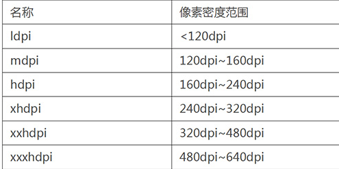
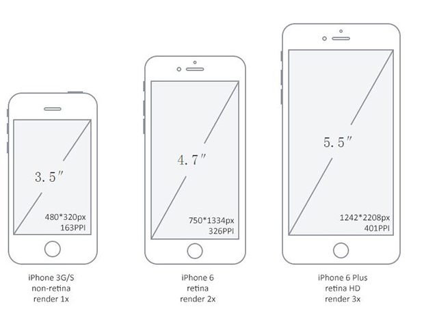
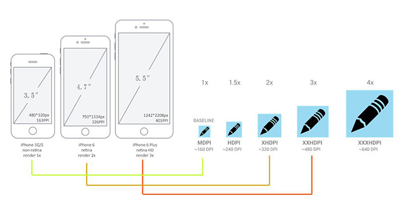
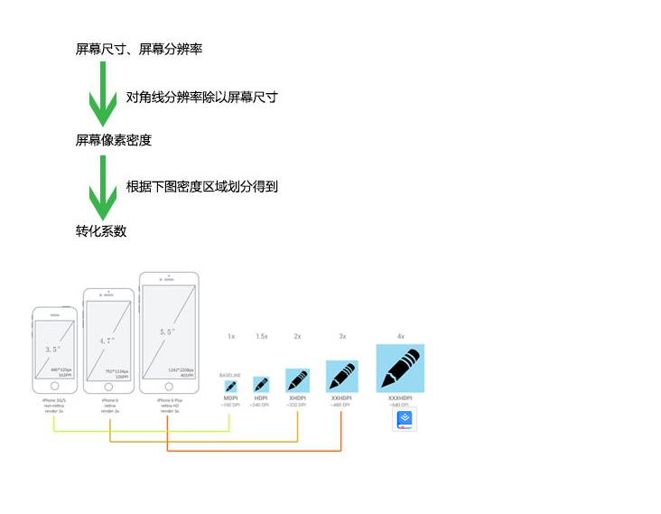

## 1.深入了解viewport和px

单位：px、pt、pc、sp、em、rem、dp、dip、ppi、dpi、ldpi、mdpi、hdpi、xhdpi、xxhdpi……

1. 什么是绝对长度？什么是相对长度

 + 绝对长度单位：
   in（inch英寸）、cm（厘米）、mm（毫米）、pt（磅）、pc（pica）。in、cm、mm和实际中的常用单位完全相同。pt是标准印刷上常用的单位，72pt的长度为1英寸。pc也是印刷上用的单位，1pc的长度为12磅。绝对长度单位，虽然理解起来很容易，但是在网页的设计中很少用到。所以我们就忽略它们吧。

 + 相对单位：
   相对单位是网页设计中使用最多的长度单位，包括px、em、rem等。

2. 什么是屏幕尺寸、屏幕分辨率、屏幕像素密度？

  + 屏幕尺寸：
    屏幕尺寸指屏幕的对角线的长度，单位是英寸，1英寸=2.54厘米。常见的屏幕尺寸有2.4、2.8、3.5、3.7、4.2、5.0、5.5、6.0等。

  + 屏幕分辨率：
    屏幕分辨率指在横纵向上的像素点数，单位是px，1px=1个像素点。一般以纵向像素*横向像素来表示一个手机的分辨率，如1960*1080。（这里的1像素值得是物理设备的1个像素点）

  + 屏幕像素密度：
    屏幕上每英寸可以显示的像素点的数量，单位是ppi（pixels per inch）。屏幕像素密度与屏幕尺寸和屏幕分辨率有关，在单一变化条件下，屏幕尺寸越小、分辨率越高，像素密度越大，反之越小。
    算出对角线的分辨率：Math.sqrt(1920²+1080²) ≈2203px
    像素密度为对角线分辨率除以屏幕尺寸：2203/5≈440dpi。

3. 什么是ppi、dpi、dp、dip、sp、px？

  + ppi（pixels per inch）：屏幕上每英寸可以显示的像素点的数量，即屏幕像素密度。
  + dpi（dots per inch）：最初用于衡量打印物上每英寸的点数密度，就是打印机可以在一英寸内打多少个点。当dpi的概念用在计算机屏幕上时，就称之为ppi。ppi和dpi是同一个概念，Android比较喜欢使用dpi，IOS比较喜欢使用ppi。
  + dp、dip：dp和dip都是Density Independent Pixels的缩写，密度独立像素，可以想象成是一个物理尺寸，使同样的设置在不同手机上显示的效果看起来是一样的。

在Android中，规定以160dpi为基准，1dp=1px。如果密度是320dpi，则1dp=2px，以此类推。

Android和IOS都会通过转换系数让控件适应屏幕的尺寸。一个按钮给了44*44dp的大小，在160dpi密度的时候，按钮就是44*44px大小；在320dpi密度的时候，按钮就是88*88px的大小。不需要我们去书写多套尺寸。

  + sp（scale independent pixels）：用法与dp类似，是专门用来定义文字大小的，受用户android设备字体设置的影响。

  + px：就是通常所说的像素，使网页设计中使用最多的长度单位。将显示器分成非常细小的方格，每个方格就是一个像素。（网页重构中使用的px和屏幕分辨率的px不一定是一样的大小。）

4. 什么是mdpi、hdpi、xdpi、xxdpi？
Google官方指定按照下列标准区分不同设备的dpi：

苹果的区分则更为简单：非高清屏、高清屏、超高清屏。

从数值上看，苹果和安卓有这样的对应关系：

我们重构移动页面的时候使用px其实跟安卓开发中使用dp是一样的，有个背后的系数会帮我们把数值适配到这款手机的大小。而这个系数就是上图的1x、2x、3x……这个系数怎么来？是依靠分辨率和屏幕尺寸计算到的屏幕像素密度，再看屏幕像素密度属于哪个系数等级。

以上是单位的介绍，下面再来认识个重要的知识点：viewpoint。

手机浏览器是把页面放在一个虚拟的“窗口”（viewport）中，窗口可大于或小于手机的可视区域，一般手机默认viewport大于可视区域。这样不会破坏没有针对手机浏览器优化的网页的布局，用户可以通过平移和缩放来看网页的其他部分。

部分机型默认viewport大小：

每个设置对应的是：

这个页面背景图是作为背景给了background-size:100%;的，所以整好铺满整个屏幕，大小看起来很适合。而上面的元素使用固定的px值来赋予大小的，例如左上角的人头给了width:100px;height100%;。为什么两者分别是这样子显示的？

网页重构时使用的单位px，就是通常所说的像素，是网页设计中使用最多的长度单位。将显示器分成非常细小的方格，每个方格就是一个像素（这和我们理解的屏幕分辨率的1920px*1080px的px是不同的）。不同设置下，方格的大小不一样。

例如iPhone4S如果不设置viewport，他就会默认是980px，就像把屏幕分成980份（不是屏幕分辨率的640px哦！）。如果设置一个元素为100px*100px，看起来就是屏幕的100/980，可能如下图所示：

例如iPhone4S如果设置viewport width=device-width，他就会是320px，就像把屏幕分成320份（不是屏幕分辨率的640px哦！）。如果设置一个元素为100px*100px，看起来就是屏幕的100/320，可能如下图所示：

未设置viewport，弹出来的都是设备的默认宽度，基本是980px，除了最后一台三星老爷机是800px。

设置了viewport，width=device-width，弹出来的是设置好的宽度，375px、360px、320px。为什么是这个大小？这就要用到上面讲的知识点了。

iPhone6的屏幕分辨率是1334*750px，ppi是326，所以系数是2x。那device-width就等于750/2=375px。

红米1s的屏幕分辨率是1280*720px，ppi是312，所以系数是2x。那device-width就等于720/2=360px。

页面里的红色块给的是200*200px，在几个设备看起来好像差不多大的样子。

（上图左边是三星note4，右图是红米1s）

三星note4的屏幕分辨率是2560*1440px，ppi是515，所以系数是4x。那device-width就等于1440/4=360px，和小米的divice-width一样大小。但是看起来左边的红色块明显大于右边，因为左边的设备大啊，虽然两者都是分成360份，但是明显左边的1份比右边的1份大。

以上解释了为什么给元素赋予固定的像素值，给字体16px的大小，在大部分手机里居然能看起来差不多大小，也明白了我们并不需要写其他尺寸来适配不同的屏幕大小。不知道我这样拐弯的解释大家能明白不？

对于应该按照多大的尺寸来设计移动网页，这个看设计师喜欢，640是以前的主流，因为好多设计师用的是iPhone4S、5S。现在在慢慢转向750，因为iPhone升级成6了。不管哪种尺寸的设计稿，重构都可以用一套方法制作好页面，如果是背景平铺（background-size:100%）、上面的元素px设置大小的话，没问题，能顺利适配其他手机的。如果是固定整体大小重构，再利用js判断屏幕大小进行页面缩放，也没问题，能顺利适配其他手机的。重要的前提是要设置好正确的viewport。

参考：

理解Android中dpi和分辨率的关系，谈谈Android做成适应全部手机的UI方式

http://blog.csdn.net/ueryueryuery/article/details/20048401

UI设计师不可不知的安卓屏幕知识

http://www.zcool.com.cn/article/ZNjI3NDQ=.html

Android屏幕适配全攻略(最权威的官方适配指导)

http://blog.csdn.net/jdsjlzx/article/details/45891551

移动前端开发之viewport的深入理解

http://www.cnblogs.com/2050/p/3877280.html

iPhone 6 Screens Demystified

http://www.paintcodeapp.com/news/iphone-6-screens-demystified

如何做跨DPI设计

http://www.ui.cn/detail/23624.html
