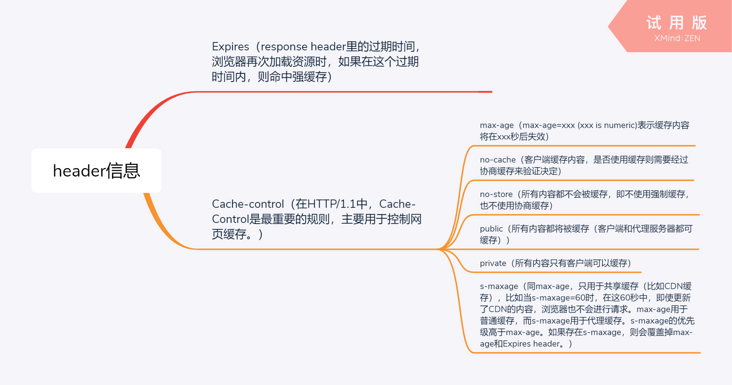
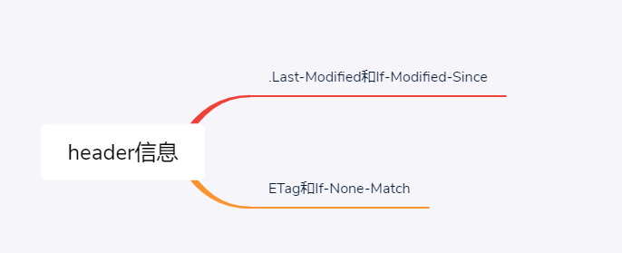
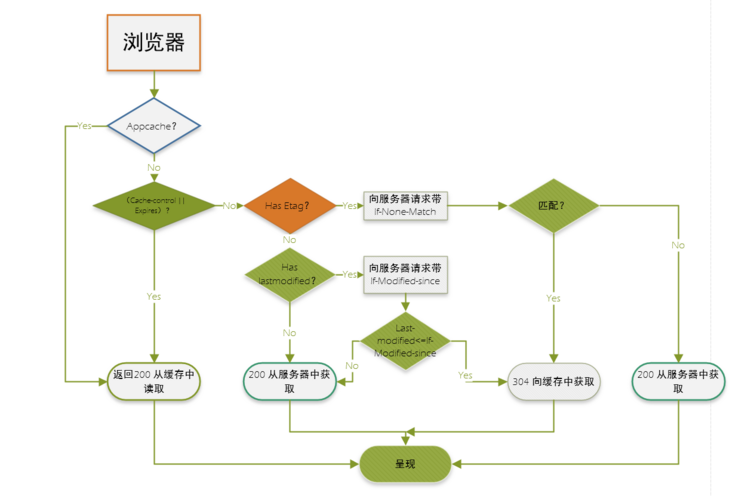

如果本地硬盘满了，所有缓存策略都将失效


# 1. 缓存策略

1. 了解HTTP协议的ETag

缓存从宏观上分为私有缓存和共享缓存，共享缓存就是那些能被各级代理缓存的缓存。私有缓存就是用户专享的，各级代理不能缓存的缓存。

### 1.1 使用原因

1. 用户数增长（导致服务器访问次数增加，减少服务器压力），架构演变（架构需要），数据量增大（请求数据量多，服务器压力较大，响应速度变慢），开始考虑怎么去做性能优化
2. 而性能优化的第一定律就是：优先考虑使用缓存。

### 1.2 缓存的作用

#### 1.2.1.  加快数据访问速度

这是衡量缓存有效性的重要指标。命中率越高，表明缓存的使用率越高。

#### 1.2.2.  减轻后端应用和数据存储的负载压力

一旦缓存中元素数量超过这个值(或者缓存数据空间超过其最大支 持空间)，将会触发淘汰策略。

#### 1.2.3.  淘汰策略

FIFO(First In First Out) 先进先出，淘汰最早数据。

判断存储时间，离目前最远的数据优先淘汰。

LRU (Least Recently Used)剔除最近最少使用。

判断最近使用时间，离目前最远的数据优先淘汰。

LFU (Least Frequently Used)剔除最近使用频率最低的数据。

在一段时间内，数据被使用次数最少的，优先淘汰。

### 1.3 分类：

缓存的主要手段有：浏览器缓存、CDN、反向代理、本地缓存、分布式缓存、数据库缓存。

在解读《大型网站技术架构》一文中，其实已经说到过。

我们一般说做性能优化时是指后三个：本地缓存、分布式缓存、数据库缓存。

前面三个缓存策略属于网站前端的范畴。

从硬件介质上来看，缓存分为内存和硬盘两种。

但从技术上，又可以分成内存、硬盘文件、数据库。

我们通常意义上说的缓存一般都是基于内存的。

因为只有内存，才足够快。

数据库缓存一般也是基于内存的，但这个活一般是DBA在配置数据库的时候就设置好了。

对于大部分开发人员来说，我们一般所说的缓存优化都是基于本地缓存(ocal cache)和远程缓存(remote cache)。

而现在远程缓存这个词一般也被分布式缓存这个常用方案所代指。

### 1.4 特征

1. 命中率：命中率 = 命中数 / 请求数
2. 最大元素（最大空间）

### 1.5 使用时机

#### 1.5.1、是不是热点数据?

所谓热点，一般是遵循二八定律，即百分之八十的访问集中在百分之二十的数据上。

#### 1.5.2、是不是读比写多?

这个比例一般为2:1。

### 1.5.6 常见问题

#### 1.5.6.1 缓存更新带来的数据不一致与脏读

缓存更新的常见策略有：

1、先更新数据库再更新缓存;

2、先更新数据库再删除缓存;

3、先删除缓存再更新数据库;

4、定时清理缓存;

5、有请求访问数据时，判断缓存是否过期，过期从数据库中刷新缓存。

在这几种方案中，如果修改缓存与数据库不在同一个事物中，就带来了数据不一致和脏读的问题。

对应方案1：先删除缓存再更新数据库，并且在同一个事物中。

对应方案2：缓存自动失效后，另外的异步线程进行缓存更新。

对应方案3：缓存更新在并发、分布式要考虑锁，redis天生就是单线程，比较有优势。

#### 1.5.6.2 怎么做缓存预热

缓存预热是指在用户可访问服务之前，将热点数据加载到缓存的操作，这样可以有效避免上线后瞬时大流量造成系统不可用。

缓存预热的一般性策略：

1、开发个缓存刷新功能，手工刷新;

2、项目启动的时候自动进行加载(一般为字典表等数据量不大的数据);

3、设置个定时器，自动刷新缓存;

4、提前统计热点数据，事先批量加载到如redis这样缓存工具中。

#### 1.5.6.3 缓存重建

缓存失效后，重建热点缓存，如果耗时较长，在重建过程中，性能、负载不好。

对应方案：

1、正常情况下，交错缓存失效时间，减轻缓存压力;

2、崩溃失效的情况下，可以使用带持久化功能的缓存来恢复，比如Redis;

3、如果是MongoDB则不太一样，它是采用mmap来将数据文件映射到内存中，所以当MongoDB重启时，这些映射的内存并不会清掉，不需要进行缓存重建与预热。

#### 1.5.6.4 缓存雪崩与可用性

缓存雪崩：缓存在同一时间失效时，访问直达数据库层，可能导致DB挂掉、系统崩溃。

对应方案1：交错缓存失效时间或随机缓存失效时间。

对应方案2：主从热备(Redis sentinel)。

对应方案3：集群/水平切分(Redis Cluster、一致性哈希)。

#### 1.5.6.4 缓存穿透

缓存穿透：持续高并发访问某个不存在的Key。

对应方案1：空值缓存。

对应方案2：布隆过滤器(bloom filter) + bitmap。穷举可能访问的数据放入bitmap中，使用hash访问。

#### 1.5.6.4  缓存击穿

缓存击穿：热点Key失效，高并发请求，直击数据库。

缓存击穿与缓存穿透很相似，不同点是是缓存击穿前访问的是真实的热点数据，只是在某一刹那失效了，造成了击穿的效果。

这样看，它其实也是缓存雪崩的一个特例。与雪崩的区别即在于击穿是对于特定的热点数据，而雪崩是全部数据。

对应方案：多级缓存及交错失效时间 + LRU 淘汰算法。

对于热点数据进行二级或多级缓存，并对于不同级别的缓存设定不同的失效时间，缓解雪崩。

此外可使用LRU的变种算法LRU-K缓存数据。

#### 1.5.6.4 缓存降级

缓存降级是服务降级中的一环。

在访问量剧增，导致服务出现问题时，为了保证核心服务可用，防止发生缓存雪崩，可进行服务降级。

以redis为例，比较常见的做法就是，不去数据库查询，而是直接返回默认值给用户。

缓存降级也可根据日志级别进行预案设置。

#### 1.5.6.4 分布式缓存的选型

说了这么多缓存的原理与策略，说说我们在实际工作中应该怎么去做缓存选型。

以下就是常用的几种缓存工具。

+ **Ehcache**

  Ehcache是纯Java开源的缓存框架，最早从hibernate发展而来，现在算是springboot中的官配缓存工具，整合简单。特点如下：

  - 快速，针对大型高并发系统场景，Ehcache的多线程机制有相应的优化改善;
  - 简单，很小的jar包，简单配置就可直接使用，单机场景下无需过多的其他服务依赖;
  - 支持多种的缓存策略，灵活;
  - 缓存数据有两级：内存和磁盘，与一般的本地内存缓存相比，有了磁盘的存储空间，将可以支持更大量的数据缓存需求;
  - 具有缓存和缓存管理器的侦听接口，能更简单方便的进行缓存实例的监控管理;
  - 支持多缓存管理器实例，以及一个实例的多个缓存区域。

+ **Guava Cache**

  Guava Cache是Google开源的Java重用工具集库Guava里的一款缓存工具，特点如下：

  - 自动将entry节点加载进缓存结构中;
  - 当缓存的数据超过设置的最大值时，使用LRU算法移除;
  - 具备根据entry节点上次被访问或者写入时间计算它的过期机制;
  - 缓存的key被封装在WeakReference引用内;
  - 缓存的Value被封装在WeakReference或SoftReference引用内;
  - 统计缓存使用过程中命中率、异常率、未命中率等统计数据。

+ **Memcache**

  memcache本身不支持分布式，是通过客户端的路由处理来达到分布式解决方案的目的。特点如下：

  - memcache使用预分配内存池的方式管理内存;
  - 所有数据存储在物理内存里;
  - 非阻塞IO复用模型，纯KV存取操作;
  - 多线程，效率高，会遇到锁等上下文切换问题;
  - 只支持简单KV数据类型;
  - 数据不支持持久化。

+ **Redis**

  Redis是当前主流的高性能内存数据库，多用于存储缓存数据，并能实现轻量级的MQ功能。特点如下：

  - 临时申请空间，可能导致碎片;
  - 有VM机制，能存储更多数据，超过内存空间后会导致swap，降低效率;
  - 非阻塞IO复用模型，支持额外CPU计算：排序、聚合，会影响IO性能;
  - 单线程，无锁，无上下文切换，单实例无法利用多核性能;
  - 支持多种数据类型：string / hash / list / set / sorted set;
  - 数据支持持久化：AOF(语句增量)/RDB(fork全量);
  - 天然支持高可用分布式方案sentinel +;
  - cluster(故障自动转移+集群)。

+ **推荐**

  通常情况下，单机我们会用Ehcache，甚至java自己的concurrenthashmap来实现缓存。分布式一般使用redis。

+ 【编辑推荐】

  1. [带你100% 地了解 Redis 6.0 的客户端缓存](http://stor.51cto.com/art/202005/616314.htm)
  2. [3种堆内缓存算法，赠源码和设计思路](http://stor.51cto.com/art/202005/616346.htm)
  3. [要及时「缓存」你们的珍贵时光](http://stor.51cto.com/art/202005/616985.htm)
  4. [缓存同步、如何保证缓存一致性、缓存误用](http://stor.51cto.com/art/202006/617889.htm)
  5. [记一次接口性能优化实践总结：优化接口性能的八个建议](http://stor.51cto.com/art/202006/618212.htm)

### 小程序简单缓存测试

```javascript
// 有用公司的框架 
const lastTime = Date.now()
 const localStorage = await rjMy.getStorage({
     key: 'user',
 })
 if (localStorage.success) {
     state.user = JSON.parse(localStorage.data)
 } else {
     const user = await cloudDbClient.collection("user").find()
     const storageFunc = await rjMy.setStorage({
         key: 'user',
         data: JSON.stringify(user),
     })
     state.user = user
 }
 stateControl.update();


// 没用缓存大概需要八九百毫秒  用了缓存后只需要六十几毫秒
```


# 2. 各种缓存策略介绍

## 2.1 浏览器缓存http缓存

### 2.1.1 强缓存

1. 不会向服务器发送请求，直接从缓存中读取资源
2. 请求返回200的状态码
3. 在chrome控制台的network选项中可以看到size显示from disk cache 或 from memory cache

from memory cache代表使用内存中的缓存，from disk cache则代表使用的是硬盘中的缓存，浏览器读取缓存的顺序为memory –> disk。在浏览器中，浏览器会在js和图片等文件解析执行后直接存入内存缓存中，那么当刷新页面时只需直接从内存缓存中读取(from memory cache)；而css文件则会存入硬盘文件中，所以每次渲染页面都需要从硬盘读取缓存(from disk cache)。



Expires和Cache-Control两者对比：其实这两者差别不大，区别就在于 Expires 是http1.0的产物，Cache-Control是http1.1的产物，两者同时存在的话，Cache-Control优先级高于Expires


### 2.1.2 协商缓存

协商缓存就是强制缓存失效后，浏览器携带缓存标识向服务器发起请求，由服务器根据缓存标识决定是否使用缓存的过程

- 协商缓存生效，返回304和Not Modified



#### + Last-Modified和If-Modified-Since

浏览器在第一次访问资源时，服务器返回资源的同时，在response header中添加 Last-Modified的header，值是这个资源在服务器上的最后修改时间，浏览器接收后缓存文件和header；

浏览器下一次请求这个资源，浏览器检测到有 Last-Modified这个header，于是添加If-Modified-Since这个header，值就是Last-Modified中的值；服务器再次收到这个资源请求，会根据 If-Modified-Since 中的值与服务器中这个资源的最后修改时间对比，如果没有变化，返回304和空的响应体，直接从缓存读取，如果If-Modified-Since的时间小于服务器中这个资源的最后修改时间，说明文件有更新，于是返回新的资源文件和200

> 缺点：1、某些服务端不能获取精确的修改时间 2、文件修改时间改了，但文件内容却没有变

#### + ETag和If-None-Match

Etag是上一次加载资源时，服务器返回的response header，是对该资源的一种唯一标识，只要资源有变化，Etag就会重新生成。浏览器在下一次加载资源向服务器发送请求时，会将上一次返回的Etag值放到request header里的If-None-Match里，服务器只需要比较客户端传来的If-None-Match跟自己服务器上该资源的ETag是否一致，就能很好地判断资源相对客户端而言是否被修改过了。如果服务器发现ETag匹配不上，那么直接以常规GET 200回包形式将新的资源（当然也包括了新的ETag）发给客户端；如果ETag是一致的，则直接返回304知会客户端直接使用本地缓存即可

#### # 协商缓存两种方式的对比

1. 首先在精确度上，Etag要优于Last-Modified，Last-Modified的时间单位是秒，如果某个文件在1秒内改变了多次，那么他们的Last-Modified其实并没有体现出来修改，但是Etag每次都会改变确保了精度；如果是负载均衡的服务器，各个服务器生成的Last-Modified也有可能不一致。
2. 性能上，Etag要逊于Last-Modified，毕竟Last-Modified只需要记录时间，而Etag需要服务器通过算法来计算出一个hash值。
3. 优先级上，服务器校验优先考虑Etag

### 2.1.3 缓存机制

appcache优先于强缓存，强制缓存优先于协商缓存进行，若强制缓存(Expires和Cache-Control)生效则直接使用缓存，若不生效则进行协商缓存(Last-Modified / If-Modified-Since和Etag / If-None-Match)，协商缓存由服务器决定是否使用缓存，若协商缓存失效，那么代表该请求的缓存失效，返回200，重新返回资源和缓存标识，再存入浏览器缓存中；生效则返回304，继续使用缓存。具体流程看下图：



不管是浏览器缓存，还是代理服务器缓存，CDN缓存都遵循客户端与服务端之间的缓存机制


### 2.1.4 本地存储

本地存储主要有以下几种，localStorage，sessionStorage和cookie，WebSql和IndexDB主要用在前端有大容量存储需求的页面上，例如，在线编辑浏览器或者网页邮箱。他们都可以将数据存储在浏览器，应该根据不同的场景进行使用。

#### 2.1.4.1 Cookie

**Cookie主要是由服务器生成**，且前端也可以设置，保存在客户端本地的一个文件，通过response响应头的set-Cookie字段进行设置，且Cookie的内容自动在请求的时候被传递给服务器。如下：

```
[HTTP/1.1 200 OK]
Server:[bfe/1.0.8.18]
Etag:["58860415-98b"]
Cache-Control:[private, no-cache, no-store, proxy-revalidate, no-transform]
Connection:[Keep-Alive]
Set-Cookie:[BDORZ=27315; max-age=86400; domain=.baidu.com; path=/]
Pragma:[no-cache]
Last-Modified:[Mon, 23 Jan 2017 13:24:37 GMT]
Content-Length:[2443]
Date:[Mon, 09 Apr 2018 09:59:06 GMT]
Content-Type:[text/html]
```

Cookie包含的信息：
它可以记录你的用户ID、密码、浏览过的网页、停留的时间等信息。当你再次来到该网站时，网站通过读取Cookies，得知你的相关信息，就可以做出相应的动作，如在页面显示欢迎你的标语，或者让你不用输入ID、密码就直接登录等等。一个网站只能读取它自己放置的信息，不能读取其他网站的Cookie文件。因此，Cookie文件还保存了host属性，即网站的域名或ip。
这些属性以名值对的方式进行保存，为了安全，它的内容大多进行了加密处理。Cookie文件的命名格式是：用户名@网站地址[数字].txt

Cookie的优点：

- 给用户更人性化的使用体验，如记住“密码功能”、老用户登录欢迎语
- 弥补了HTTP无连接特性
- 站点统计访问人数的一个依据

Cookie的缺点：

- 它无法解决多人共用一台电脑的问题，带来了不安全因素
- Cookie文件容易被误删除
- 一人使用多台电脑
- Cookies欺骗。修改host文件，可以非法访问目标站点的Cookie
- 容量有限制，不能超过4kb
- 在请求头上带着数据安全性差


#### 2.1.4.2 localStorage

localStorage主要是前端开发人员，在前端设置，一旦数据保存在本地后，就可以避免再向服务器请求数据，因此减少不必要的数据请求，减少数据在浏览器和服务器间不必要地来回传递。

可以长期存储数据，没有时间限制，一天，一年，两年甚至更长，数据都可以使用。
localStorage中一般浏览器支持的是5M大小，这个在不同的浏览器中localStorage会有所不同

优点：

- localStorage拓展了cookie的4k限制
- localStorage可以将第一次请求的5M大小数据直接存储到本地，相比于cookie可以节约带宽
- localStorage的使用也是遵循同源策略的，所以不同的网站直接是不能共用相同的localStorage

缺点：

- 需要手动删除，否则长期存在
- 浏览器大小不一，版本的支持也不一样
- localStorage只支持string类型的存储，JSON对象需要转换
- localStorage本质上是对字符串的读取，如果存储内容多的话会消耗内存空间，会导致页面变卡


#### 2.1.4.3 sessionStorage

sessionStorage主要是前端开发人员，在前端设置，sessionStorage（会话存储），只有在浏览器被关闭之前使用，创建另一个页面时同意可以使用，关闭浏览器之后数据就会消失

存储上限限制：不同的浏览器存储的上限也不一样，但大多数浏览器把上限限制在5MB以下


#### 2.1.4.3 websql

Web SQL 是在浏览器上模拟数据库，可以使用JS来操作SQL完成对数据的读写。它使用 SQL 来操纵客户端数据库的 API，这些 API 是异步的，规范中使用的方言是SQLlite。**数据库还是在服务端**，不建议使用，已废弃


#### 2.1.4.3 indexDB

随着浏览器的功能不断增强，越来越多的网站开始考虑，将大量数据储存在客户端，这样可以减少从服务器获取数据，直接从本地获取数据。

现有的浏览器数据储存方案，都不适合储存大量数据：Cookie 的大小不超过4KB，且每次请求都会发送回服务器；LocalStorage 在 2.5MB 到 10MB 之间（各家浏览器不同），而且不提供搜索功能，不能建立自定义的索引。所以，需要一种新的解决方案，这就是 IndexedDB 诞生的背景。

通俗地说，IndexedDB 就是**浏览器提供的本地数据库**，它可以被网页脚本创建和操作。IndexedDB 允许储存大量数据，提供查找接口，还能建立索引。这些都是 LocalStorage 所不具备的。就数据库类型而言，IndexedDB 不属于关系型数据库（不支持 SQL 查询语句），更接近 NoSQL 数据库。

关于indexDB的知识可以查看这篇文章[http://www.ruanyifeng.com/blo...](http://www.ruanyifeng.com/blog/2018/07/indexeddb.html)

这里，我只是根据自己的理解整理了一下关于缓存，存储方面的知识，还有很多不足的地方，更多实践的知识，还请查看其他文章，如有错误，请指出